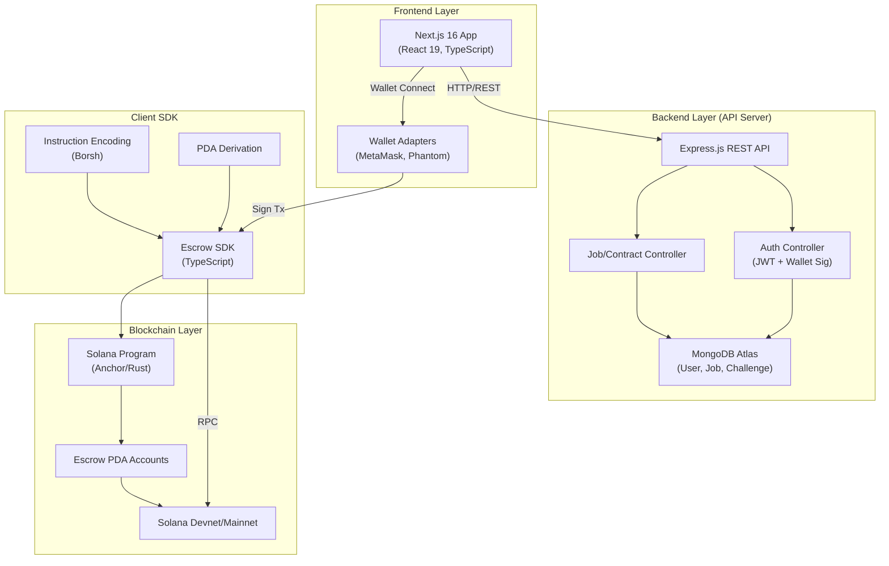
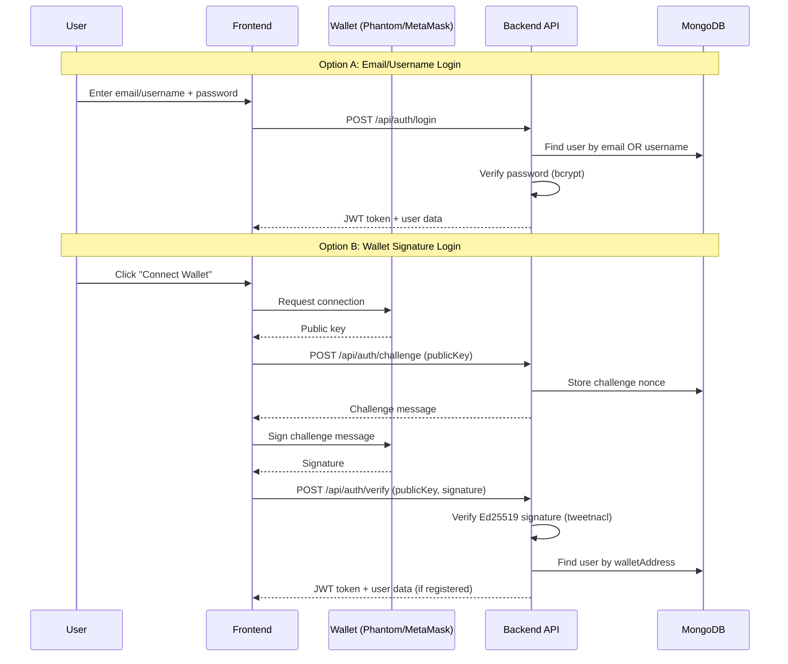
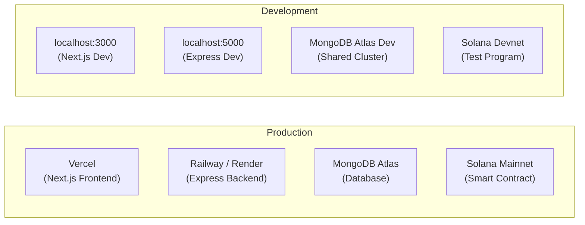

# ChainWork — System Architecture

> **Decentralized Freelancing Marketplace powered by Blockchain Escrow**
>
> Version: 1.0.0 | Last Updated: April 29, 2026

---

## 1. Project Vision & Mission

**ChainWork** is a decentralized freelancing platform that eliminates trust issues between clients and freelancers by leveraging blockchain-based escrow smart contracts. The platform enables:

- **Zero-intermediary payments** — No 20% platform fees like traditional marketplaces
- **Trustless escrow** — Funds locked in smart contracts, released only upon milestone completion
- **Multi-chain support** — Pay and get paid in ETH, MATIC, SOL, or Stablecoins
- **Cryptographic identity** — Wallet-based authentication (MetaMask, Phantom)
- **On-chain reputation** — Verified reviews and trust scores backed by blockchain data

### Core Value Proposition

| Traditional Platforms     | ChainWork                              |
| ------------------------- | -------------------------------------- |
| 20% platform fee          | 0% platform fee                        |
| Centralized escrow        | Smart contract escrow                  |
| Email/password login      | Wallet-based + hybrid auth             |
| Opaque dispute resolution | On-chain arbitration                   |
| Single currency           | Multi-chain, multi-token               |
| Centralized reputation    | On-chain, verifiable trust scores      |

---

## 2. High-Level Architecture Diagram



---

## 3. Technology Stack

### Frontend
| Technology       | Version   | Purpose                                 |
| ---------------- | --------- | --------------------------------------- |
| Next.js          | 16.2.2    | React framework, SSR, file-based routing |
| React            | 19.2.4    | UI component library                    |
| TypeScript       | ^5        | Type safety                             |
| Tailwind CSS     | ^4        | Utility-first styling                   |
| Inter (Google)   | —         | Primary typography                      |
| Material Symbols | —         | Icon system                             |
| Space Mono       | —         | Monospace / technical data font          |

### Backend
| Technology       | Version   | Purpose                                 |
| ---------------- | --------- | --------------------------------------- |
| Node.js          | 20.x LTS  | Runtime environment                     |
| Express.js       | 4.18.x    | HTTP server framework                   |
| MongoDB          | Atlas     | Document database (users, jobs, etc.)   |
| Mongoose         | 5.x       | MongoDB ODM                             |
| JWT              | —         | Authentication tokens                   |
| bcryptjs         | —         | Password hashing                        |
| bs58             | 4.x       | Base58 encoding (Solana addresses)       |
| tweetnacl        | —         | Ed25519 signature verification           |

### Blockchain / Smart Contract
| Technology       | Version   | Purpose                                 |
| ---------------- | --------- | --------------------------------------- |
| Solana           | Mainnet   | Primary blockchain network               |
| Anchor           | —         | Solana program framework (Rust)          |
| Rust             | —         | Smart contract language                  |
| @solana/web3.js  | 1.98.x    | Solana JavaScript SDK                    |
| @coral-xyz/borsh | 0.31.x    | Borsh serialization for instructions     |
| @solana/spl-token| 0.4.x     | SPL Token interactions                   |

---

## 4. User Roles

### Client (Job Poster)
- Posts job contracts with budgets and requirements
- Selects target blockchain for payment
- Funds escrow smart contracts
- Reviews proposals from freelancers
- Approves milestones to release payments
- Manages active mandates and escrowed capital

### Freelancer (Service Provider)
- Browses marketplace for open opportunities
- Submits proposals with bids
- Delivers work against milestones
- Receives payments from escrow upon approval
- Builds on-chain reputation through reviews
- Manages portfolio and skill profile

---

## 5. Core User Flows

### 5.1 Job Lifecycle (Happy Path)

```mermaid
sequenceDiagram
    participant C as Client
    participant FE as Frontend
    participant BE as Backend API
    participant SC as Smart Contract
    participant F as Freelancer

    C->>FE: Create Job (title, description, budget, chain)
    FE->>BE: POST /api/jobs
    BE->>BE: Save job to MongoDB
    BE-->>FE: Job created (jobId)

    F->>FE: Browse Marketplace
    FE->>BE: GET /api/jobs
    BE-->>FE: Job listings

    F->>FE: Submit Proposal
    FE->>BE: POST /api/jobs/:id/proposals
    BE-->>FE: Proposal submitted

    C->>FE: Accept Proposal
    FE->>SC: initializeSol(freelancer, amount)
    SC->>SC: Create Escrow PDA, lock funds
    SC-->>FE: Escrow created (tx hash)
    FE->>BE: PATCH /api/jobs/:id (status: active, escrowAddress)

    F->>FE: Submit Deliverable
    FE->>BE: PATCH /api/jobs/:id/deliver

    C->>FE: Approve & Release Payment
    FE->>SC: releaseSol(escrowPda)
    SC->>SC: Transfer funds to freelancer
    SC-->>FE: Payment released (tx hash)

    C->>FE: Leave Review
    FE->>BE: POST /api/reviews
```



### 5.2 Authentication Flow



---

## 6. Directory Structure

```
Chain-Work/
├── app/                          # Next.js 16 Frontend
│   ├── components/               # Shared UI components
│   │   ├── Footer.tsx
│   │   ├── SideNavBar.tsx        # Dashboard navigation
│   │   └── ui/                   # Atomic UI components
│   │       ├── ChatMessage.tsx
│   │       ├── NetworkSelector.tsx
│   │       ├── NotificationItem.tsx
│   │       ├── PortfolioCard.tsx
│   │       ├── RatingCard.tsx
│   │       ├── Toast.tsx
│   │       └── TransactionRow.tsx
│   ├── create-job/page.tsx       # Job creation form
│   ├── dashboard/
│   │   ├── client/page.tsx       # Client management dashboard
│   │   └── freelancer/page.tsx   # Freelancer earnings dashboard
│   ├── job/[id]/page.tsx         # Dynamic job detail page
│   ├── marketplace/page.tsx      # Job listing marketplace
│   ├── messaging/page.tsx        # P2P encrypted messaging
│   ├── notifications/page.tsx    # Activity notifications
│   ├── portfolio/page.tsx        # Freelancer portfolio
│   ├── reviews/page.tsx          # On-chain reputation
│   ├── settings/page.tsx         # User settings & wallet mgmt
│   ├── transactions/page.tsx     # Financial audit trail
│   ├── globals.css               # Design system tokens
│   ├── layout.tsx                # Root layout + nav
│   └── page.tsx                  # Landing page (hero)
├── docs/                         # Project documentation
│   ├── architecture.md           # This file
│   ├── frontend.md               # Frontend deep-dive
│   ├── backend.md                # Backend deep-dive
│   └── smart_contract.md         # Smart contract deep-dive
├── package.json
├── tsconfig.json
├── next.config.ts
└── postcss.config.mjs
```

### Backend (Separate Repository: `/Chainwork/server/`)
```
server/
├── controllers/
│   ├── authController.js         # Auth logic (register, login, wallet verify)
│   └── contractController.js     # Job/contract CRUD
├── models/
│   ├── User.js                   # User schema (Mongoose)
│   ├── Job.js                    # Job schema
│   └── Challenge.js              # Wallet auth challenge nonce
├── routes/
│   ├── auth.js                   # Auth routes
│   └── contracts.js              # Contract routes
├── utils/
│   ├── auth.js                   # JWT helpers
│   └── solana.js                 # Solana RPC helpers
├── server.js                     # Express entry point
├── swagger.js                    # API documentation
└── .env                          # Environment variables
```

### Smart Contract (Separate: `/Chainwork/solana-program/`)
```
solana-program/
├── programs/
│   └── sol-marketplace/
│       └── src/
│           ├── lib.rs            # Program entry point
│           └── instructions/     # Instruction handlers
├── SDK/
│   ├── index.ts                  # SDK exports
│   ├── client.ts                 # EscrowClient class
│   ├── instructions.ts           # Instruction builders
│   ├── types.ts                  # Type definitions
│   ├── pdas.ts                   # PDA derivation
│   └── utils.ts                  # Borsh decoding helpers
└── target/
    └── idl/                      # Generated IDL
```

---

## 7. Data Models

### User
```json
{
  "_id": "ObjectId",
  "username": "string (unique)",
  "email": "string (unique)",
  "password": "string (hashed, bcrypt)",
  "role": "enum: [freelancer, client]",
  "walletAddress": "string (Solana pubkey)",
  "skills": ["string"],
  "bio": "string",
  "avatar": "string (URL)",
  "trustScore": "number",
  "totalEarnings": "number",
  "createdAt": "Date"
}
```

### Job
```json
{
  "_id": "ObjectId",
  "title": "string",
  "description": "string",
  "budget": "number (USDC)",
  "timeline": "enum: [2weeks, 1month, longterm]",
  "chain": "enum: [solana, ethereum, polygon]",
  "skills": ["string"],
  "status": "enum: [open, active, completed, disputed]",
  "client": "ObjectId (ref: User)",
  "freelancer": "ObjectId (ref: User)",
  "escrowAddress": "string (on-chain PDA)",
  "proposals": [{
    "freelancer": "ObjectId",
    "bid": "number",
    "coverLetter": "string",
    "status": "enum: [pending, accepted, rejected]"
  }],
  "createdAt": "Date"
}
```

### Challenge (Wallet Auth)
```json
{
  "_id": "ObjectId",
  "publicKey": "string (Solana pubkey)",
  "nonce": "string (random challenge)",
  "message": "string (human-readable challenge)",
  "expiresAt": "Date (TTL index)"
}
```

---

## 8. Supported Blockchain Networks

| Network     | Status      | Token     | Escrow Support |
| ----------- | ----------- | --------- | -------------- |
| Solana      | ✅ Primary   | SOL, USDC | ✅ Smart Contract |
| Ethereum    | 🔲 Planned  | ETH, USDC | 🔲 Solidity Contract |
| Polygon     | 🔲 Planned  | MATIC     | 🔲 Solidity Contract |
| Arbitrum    | 🔲 Planned  | ETH       | 🔲 L2 Contract |

---

## 9. Security Architecture

### Authentication
- **JWT tokens** for session management (stateless)
- **Ed25519 signature verification** for wallet-based auth (tweetnacl)
- **bcrypt** password hashing with salt rounds
- **Challenge-response protocol** to prevent replay attacks on wallet auth
- **Rate limiting** on auth endpoints

### Smart Contract
- **PDA (Program Derived Address)** for deterministic escrow accounts
- **Authority checks** — only the initializer can release or cancel
- **Deadline support** — optional time-locked escrows
- **Multi-sig potential** — extensible for arbitration
- **No admin keys** — fully trustless once deployed

### Data
- **MongoDB Atlas** with encrypted connections
- **Environment variable isolation** for secrets
- **CORS configuration** for API access control

---

## 10. Deployment Strategy



---

## 11. Related Documentation

| Document                                            | Description                                      |
| --------------------------------------------------- | ------------------------------------------------ |
| [frontend.md](./frontend.md)                        | Frontend architecture, pages, components, design  |
| [backend.md](./backend.md)                          | Backend API, controllers, models, auth flow       |
| [smart_contract.md](./smart_contract.md)            | Solana program, SDK, escrow lifecycle              |
