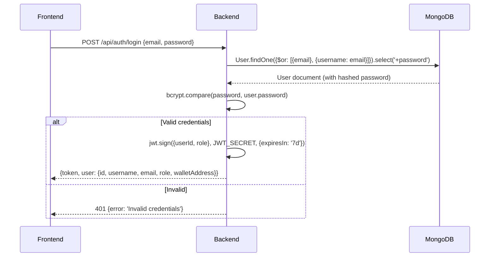
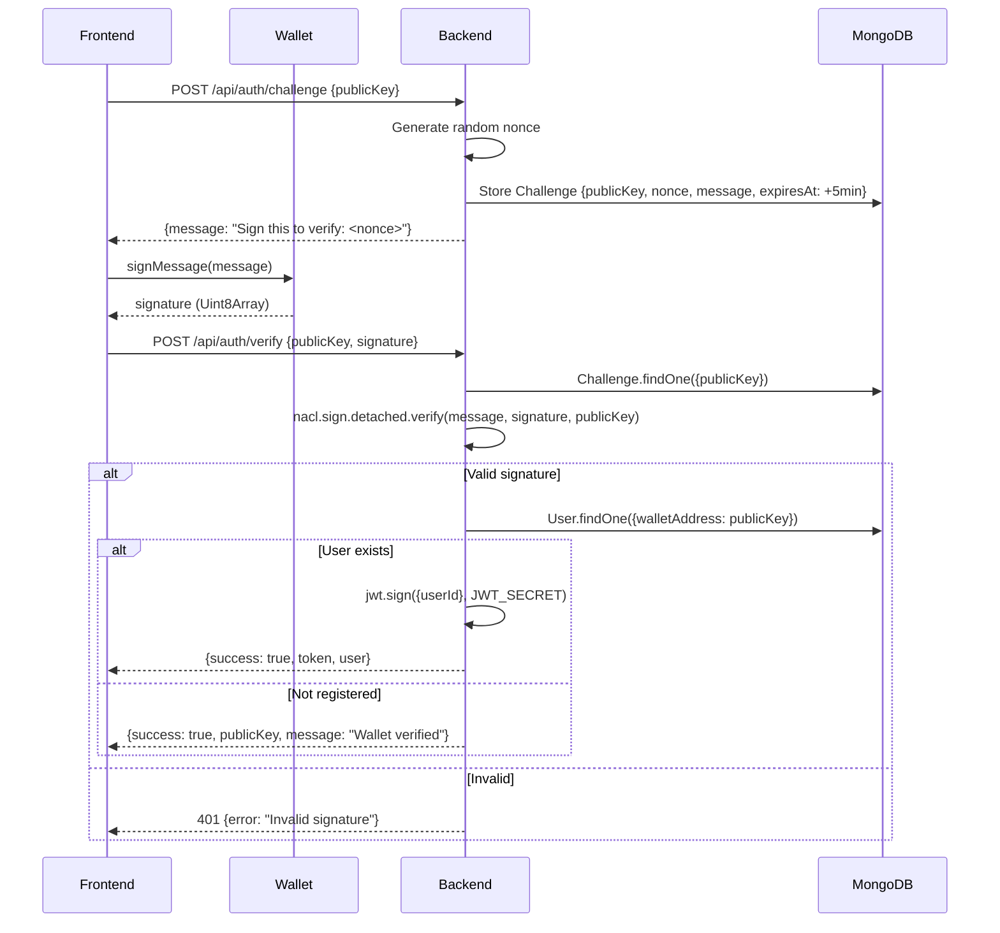

# ChainWork — Backend Architecture

> **Node.js 20 · Express.js 4.18 · MongoDB Atlas · Mongoose 5.x**
>
> Last Updated: April 29, 2026

---

## 1. Overview

The ChainWork backend is a **RESTful API server** built with Express.js that handles:
- User authentication (email/password + wallet signature verification)
- Job/contract CRUD operations
- Proposal management
- MongoDB data persistence via Mongoose ODM

The backend does **NOT** interact with the blockchain directly — all on-chain transactions are handled client-side via the Escrow SDK. The backend stores metadata (job records, escrow addresses, user profiles) in MongoDB Atlas.

---

## 2. Technology Stack

| Technology       | Version   | Purpose                                 |
| ---------------- | --------- | --------------------------------------- |
| Node.js          | 20.x LTS  | Runtime (via nvm)                       |
| Express.js       | 4.18.2    | HTTP framework                          |
| MongoDB Atlas    | Cloud     | Document database                       |
| Mongoose         | 5.13.x    | MongoDB ODM                             |
| jsonwebtoken     | 8.x       | JWT token generation/verification       |
| bcryptjs         | 2.4.x     | Password hashing (10 salt rounds)       |
| tweetnacl        | —         | Ed25519 signature verification          |
| bs58             | 4.0.x     | Base58 encoding for Solana addresses    |
| cors             | 2.8.5     | Cross-origin request handling           |
| express-rate-limit | —       | API rate limiting                       |
| dotenv           | 10.x      | Environment variable management         |
| swagger-ui-express | —       | API documentation UI                    |
| helmet           | —         | Security headers                        |

---

## 3. Directory Structure

```
server/
├── controllers/
│   ├── authController.js         # register, login, challenge, verify
│   └── contractController.js     # job CRUD, proposals
├── models/
│   ├── User.js                   # User schema
│   ├── Job.js                    # Job/contract schema
│   └── Challenge.js              # Wallet auth challenge (TTL)
├── routes/
│   ├── auth.js                   # POST /api/auth/*
│   └── contracts.js              # GET/POST /api/jobs/*
├── utils/
│   ├── auth.js                   # JWT helpers (sign, verify)
│   └── solana.js                 # Solana RPC helpers
├── docs/
│   └── swagger.json              # OpenAPI spec
├── server.js                     # Express entry point
├── swagger.js                    # Swagger middleware config
├── package.json
├── .env                          # Secrets (gitignored)
└── .env.example                  # Template for env vars
```

---

## 4. Environment Configuration

```env
# server/.env
PORT=5000
MONGO_URI=mongodb+srv://<user>:<pass>@cluster0.xxxxx.mongodb.net/chainwork
JWT_SECRET=<random-secret-key>
SOLANA_NETWORK=devnet
```

> [!CAUTION]
> Never commit `.env` to version control. The `.gitignore` excludes it.

---

## 5. Data Models

### 5.1 User Model (`models/User.js`)

```javascript
const UserSchema = new mongoose.Schema({
  username:      { type: String, required: true, unique: true, trim: true },
  email:         { type: String, required: true, unique: true, lowercase: true },
  password:      { type: String, required: true, select: false },
  role:          { type: String, enum: ['freelancer', 'client'], required: true },
  walletAddress: { type: String, unique: true, sparse: true },
  skills:        [{ type: String }],
  bio:           { type: String, maxlength: 500 },
  avatar:        { type: String },
  trustScore:    { type: Number, default: 0 },
  totalEarnings: { type: Number, default: 0 },
  createdAt:     { type: Date, default: Date.now }
});
```

**Pre-save Hook:** Hashes password with bcrypt (10 salt rounds) before save:
```javascript
UserSchema.pre('save', async function (next) {
  if (!this.isModified('password')) return next();
  const salt = await bcrypt.genSalt(10);
  this.password = await bcrypt.hash(this.password, salt);
  next();
});
```

### 5.2 Job Model (`models/Job.js`)

```javascript
const JobSchema = new mongoose.Schema({
  title:         { type: String, required: true },
  description:   { type: String, required: true },
  budget:        { type: Number, required: true },
  timeline:      { type: String, enum: ['2weeks', '1month', 'longterm'] },
  chain:         { type: String, enum: ['solana', 'ethereum', 'polygon'] },
  skills:        [{ type: String }],
  status:        { type: String, enum: ['open', 'active', 'completed', 'disputed'], default: 'open' },
  client:        { type: mongoose.Schema.Types.ObjectId, ref: 'User' },
  freelancer:    { type: mongoose.Schema.Types.ObjectId, ref: 'User' },
  escrowAddress: { type: String },
  proposals:     [{
    freelancer:  { type: mongoose.Schema.Types.ObjectId, ref: 'User' },
    bid:         { type: Number },
    coverLetter: { type: String },
    status:      { type: String, enum: ['pending', 'accepted', 'rejected'], default: 'pending' }
  }],
  createdAt:     { type: Date, default: Date.now }
});
```

### 5.3 Challenge Model (`models/Challenge.js`)

```javascript
const ChallengeSchema = new mongoose.Schema({
  publicKey: { type: String, required: true, unique: true },
  nonce:     { type: String, required: true },
  message:   { type: String, required: true },
  expiresAt: { type: Date, required: true, index: { expires: 0 } }  // TTL auto-delete
});
```

---

## 6. API Endpoints

### 6.1 Authentication Routes (`/api/auth`)

| Method | Endpoint       | Body                                      | Response                           |
| ------ | -------------- | ----------------------------------------- | ---------------------------------- |
| POST   | `/register`    | `{username, email, password, role, skills, bio, walletAddress}` | `{token, user}` |
| POST   | `/login`       | `{email, password}`                       | `{token, user}`                    |
| POST   | `/challenge`   | `{publicKey}`                             | `{message, nonce}`                 |
| POST   | `/verify`      | `{publicKey, signature}`                  | `{success, token?, user?}`         |

### 6.2 Job/Contract Routes (`/api/jobs`)

| Method | Endpoint             | Auth     | Description                |
| ------ | -------------------- | -------- | -------------------------- |
| GET    | `/`                  | Optional | List jobs (filterable)     |
| POST   | `/`                  | Required | Create job                 |
| GET    | `/:id`               | Optional | Get job details            |
| PATCH  | `/:id`               | Required | Update job (status, etc.)  |
| POST   | `/:id/proposals`     | Required | Submit proposal            |
| PATCH  | `/:id/proposals/:pid`| Required | Accept/reject proposal     |

---

## 7. Authentication System

### 7.1 Email/Username + Password Login



**Key:** The backend accepts EITHER email OR username in the `email` field using MongoDB's `$or` operator.

### 7.2 Wallet Signature Authentication



---

## 8. Server Entry Point (`server.js`)

```javascript
// Key middleware stack
app.use(helmet());                    // Security headers
app.use(cors());                      // CORS
app.use(express.json());              // Body parsing
app.use(rateLimit({ windowMs: 15*60*1000, max: 100 }));  // Rate limiting

// Routes
app.use('/api/auth', authRoutes);
app.use('/api/jobs', contractRoutes);
app.use('/api-docs', swaggerUi.serve, swaggerUi.setup(swaggerDocument));

// MongoDB connection
mongoose.connect(process.env.MONGO_URI)
  .then(() => console.log('MongoDB connected'))
  .catch(err => console.error('MongoDB error:', err));

app.listen(process.env.PORT || 5000);
```

---

## 9. Security Measures

| Layer           | Measure                              | Implementation              |
| --------------- | ------------------------------------ | --------------------------- |
| Transport       | HTTPS enforced in production         | Reverse proxy (nginx)       |
| Headers         | Security headers                     | `helmet` middleware         |
| Auth            | JWT with expiry                      | `jsonwebtoken` (7d TTL)     |
| Passwords       | Bcrypt hashing                       | 10 salt rounds              |
| Wallet          | Ed25519 signature verification       | `tweetnacl`                 |
| Rate Limiting   | 100 requests per 15 min window       | `express-rate-limit`        |
| Challenge       | TTL auto-expiry (5 min)              | MongoDB TTL index           |
| CORS            | Whitelist frontend origin            | `cors` middleware           |
| Secrets         | Environment variables                | `.env` (gitignored)         |

---

## 10. Error Handling

All controllers follow a consistent pattern:

```javascript
try {
  // Business logic
  res.json({ success: true, data: result });
} catch (error) {
  console.error('Operation failed:', error);
  res.status(500).json({ error: 'Internal server error' });
}
```

HTTP status codes used:
- `200` — Success
- `201` — Resource created
- `400` — Bad request (validation error)
- `401` — Unauthorized (auth failure)
- `404` — Resource not found
- `409` — Conflict (duplicate username/email)
- `429` — Rate limited
- `500` — Internal server error

---

## 11. Development

```bash
# Prerequisites
source ~/.nvm/nvm.sh && nvm use 20

# Install dependencies
cd server/ && npm install

# Start dev server
npm run dev          # or: node server.js

# Server runs on localhost:5000
```

### Required Environment Variables

| Variable        | Description                    | Example                              |
| --------------- | ------------------------------ | ------------------------------------ |
| `PORT`          | Server port                    | `5000`                               |
| `MONGO_URI`     | MongoDB connection string      | `mongodb+srv://...`                  |
| `JWT_SECRET`    | JWT signing secret             | `chainwork_dev_jwt_secret_2026`      |
| `SOLANA_NETWORK`| Solana cluster                 | `devnet` or `mainnet-beta`           |
