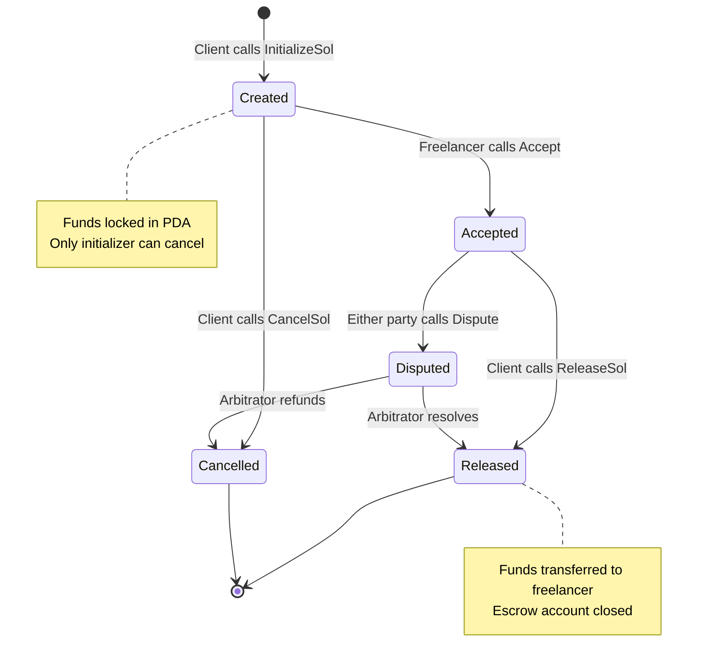

# ChainWork — Smart Contract Architecture

> **Solana · Rust (Anchor) · Escrow Program · TypeScript SDK**
>
> Last Updated: April 29, 2026

---

## 1. Overview

The ChainWork smart contract layer is a **Solana on-chain program** that implements a **trustless escrow system** for freelance payments. The program:

- Locks client funds in a Program Derived Address (PDA)
- Releases funds to the freelancer upon client approval
- Supports cancellation and refund by the initializer
- Handles both **SOL** and **SPL Token** payments
- Supports optional **deadline-based** escrows

**Program ID:** `BKrfKJSFgPP1jvAZDLxQymwQYov8ktZntVdE9TBLHrLr`

---

## 2. Program Architecture

### 2.1 Instruction Set

The program exposes 10 instructions via a `u8` discriminator:

| Discriminator | Instruction                    | Description                              |
| ------------- | ------------------------------ | ---------------------------------------- |
| `0`           | `InitializeSol`                | Create escrow funded with SOL            |
| `1`           | `InitializeSolWithDeadline`    | Create SOL escrow with expiry timestamp  |
| `2`           | `InitializeToken`              | Create escrow funded with SPL token      |
| `3`           | `InitializeTokenWithDeadline`  | Create SPL token escrow with expiry      |
| `4`           | `Accept`                       | Freelancer accepts the job contract      |
| `5`           | `ReleaseSol`                   | Release SOL to freelancer                |
| `6`           | `ReleaseToken`                 | Release SPL tokens to freelancer         |
| `7`           | `CancelSol`                    | Cancel & refund SOL to initializer       |
| `8`           | `CancelToken`                  | Cancel & refund SPL tokens               |
| `9`           | `Dispute`                      | Raise a dispute (arbitration flow)       |

### 2.2 Account Structure

#### Escrow PDA

Each escrow contract is stored in a **Program Derived Address (PDA)** derived from:

```
seeds = ["escrow", initializer_pubkey, freelancer_pubkey]
program_id = BKrfKJSFgPP1jvAZDLxQymwQYov8ktZntVdE9TBLHrLr
```

#### Escrow Account State

```rust
pub struct EscrowAccount {
    pub initializer: Pubkey,       // Client who funded the escrow
    pub freelancer: Pubkey,        // Freelancer receiving payment
    pub amount: u64,               // Locked amount (lamports or token units)
    pub is_accepted: bool,         // Whether freelancer accepted
    pub is_completed: bool,        // Whether work is complete
    pub deadline: Option<i64>,     // Optional Unix timestamp deadline
    pub token_mint: Option<Pubkey>,// SPL token mint (None for SOL)
    pub bump: u8,                  // PDA bump seed
}
```

---

## 3. Escrow Lifecycle



### Step-by-Step Flow

1. **Client creates escrow** → Calls `InitializeSol` with freelancer pubkey and SOL amount
2. **Funds locked** → SOL transferred from client wallet to escrow PDA
3. **Freelancer accepts** → Calls `Accept` to confirm they'll do the work
4. **Work delivered** → Off-chain (tracked in backend MongoDB)
5. **Client releases** → Calls `ReleaseSol` to send funds from PDA to freelancer
6. **Escrow closed** → PDA account closed, rent returned to client

---

## 4. TypeScript SDK

The frontend interacts with the Solana program via a TypeScript SDK located at `app/src/sdk/escrow/`.

### 4.1 SDK Structure

```
sdk/escrow/
├── index.ts          # Re-exports + ESCROW_PROGRAM_ID constant
├── client.ts         # EscrowClient class (main API)
├── instructions.ts   # Transaction instruction builders
├── types.ts          # Enum/interface definitions
├── pdas.ts           # PDA derivation functions
└── utils.ts          # Borsh decoding, account fetching
```

### 4.2 Core Exports (`index.ts`)

```typescript
export const ESCROW_PROGRAM_ID = new PublicKey(
  "BKrfKJSFgPP1jvAZDLxQymwQYov8ktZntVdE9TBLHrLr"
);

export { EscrowClient } from "./client";
export * from "./instructions";
export * from "./types";
export { deriveEscrowPda } from "./pdas";
```

### 4.3 EscrowClient (`client.ts`)

The `EscrowClient` class wraps all program interactions:

```typescript
class EscrowClient {
  constructor(connection: Connection, programId: PublicKey);

  // SOL escrow operations
  async initializeSol(payer, initializer, freelancer, amount): Promise<string>;
  async initializeSolWithDeadline(payer, initializer, freelancer, amount, deadline): Promise<string>;
  
  // Token escrow operations
  async initializeToken(payer, initializer, freelancer, amount, mint): Promise<string>;
  
  // Lifecycle operations
  async accept(payer, freelancer, escrowPda): Promise<string>;
  async releaseSol(payer, initializer, escrowPda): Promise<string>;
  async releaseToken(payer, initializer, escrowPda, mint): Promise<string>;
  async cancelSol(payer, initializer, escrowPda): Promise<string>;
  async cancelToken(payer, initializer, escrowPda, mint): Promise<string>;
  
  // Queries
  async getEscrowAccount(escrowPda): Promise<EscrowAccountState>;
}
```

**Key:** The `payer` parameter accepts `any` to support wallet adapter signers (not just `Keypair`).

### 4.4 PDA Derivation (`pdas.ts`)

```typescript
export function deriveEscrowPda(
  programId: PublicKey,
  initializer: PublicKey,
  freelancer: PublicKey
): { pda: PublicKey; bump: number } {
  return PublicKey.findProgramAddressSync(
    [
      Buffer.from("escrow"),
      initializer.toBuffer(),
      freelancer.toBuffer(),
    ],
    programId
  );
}
```

### 4.5 Instruction Encoding (`instructions.ts`)

All instructions use **Borsh serialization** with `@coral-xyz/borsh`:

```typescript
// Example: InitializeSol instruction
const layout = borsh.struct([
  borsh.u8("instruction"),     // discriminator = 0
  borsh.u64("amount"),         // lamports to escrow
]);

const data = Buffer.alloc(layout.span);
layout.encode({ instruction: 0, amount: BigInt(lamports) }, data);

const ix = new TransactionInstruction({
  keys: [
    { pubkey: initializer, isSigner: true, isWritable: true },
    { pubkey: freelancer, isSigner: false, isWritable: false },
    { pubkey: escrowPda, isSigner: false, isWritable: true },
    { pubkey: SystemProgram.programId, isSigner: false, isWritable: false },
  ],
  programId: ESCROW_PROGRAM_ID,
  data,
});
```

### 4.6 Types (`types.ts`)

```typescript
export enum EscrowInstruction {
  InitializeSol = 0,
  InitializeSolWithDeadline = 1,
  InitializeToken = 2,
  InitializeTokenWithDeadline = 3,
  Accept = 4,
  ReleaseSol = 5,
  ReleaseToken = 6,
  CancelSol = 7,
  CancelToken = 8,
  Dispute = 9,
}

export interface EscrowAccountState {
  initializer: PublicKey;
  freelancer: PublicKey;
  amount: bigint;
  isAccepted: boolean;
  isCompleted: boolean;
  deadline: bigint | null;
  tokenMint: PublicKey | null;
  bump: number;
}
```

### 4.7 Account Decoding (`utils.ts`)

```typescript
const EscrowAccountSchema = borsh.struct([
  borsh.publicKey("initializer"),
  borsh.publicKey("freelancer"),
  borsh.u64("amount"),
  borsh.bool("isAccepted"),
  borsh.bool("isCompleted"),
  borsh.option(borsh.i64(), "deadline"),
  borsh.option(borsh.publicKey(), "tokenMint"),
  borsh.u8("bump"),
]);

export async function fetchEscrowAccount(
  connection: Connection,
  escrowPda: PublicKey
): Promise<EscrowAccountState> {
  const accountInfo = await connection.getAccountInfo(escrowPda);
  return EscrowAccountSchema.decode(accountInfo.data);
}
```

---

## 5. Frontend Integration

### 5.1 `useEscrow` Hook

```typescript
// app/src/hooks/useEscrow.ts
export const useEscrow = () => {
  const connection = useMemo(() => 
    new Connection(clusterApiUrl('devnet')), []);
  const { address, isConnected } = useAppKitAccount();
  const { walletProvider } = useAppKitProvider('solana');

  const client = useMemo(() => 
    new EscrowClient(connection, ESCROW_PROGRAM_ID), [connection]);

  const createEscrow = async (freelancerAddress: string, amount: number) => {
    const tx = await client.initializeSol(
      walletProvider, 
      new PublicKey(address),
      new PublicKey(freelancerAddress),
      BigInt(Math.floor(amount * LAMPORTS_PER_SOL))
    );
    return tx;
  };

  return { createEscrow, client, isConnected };
};
```

### 5.2 Contract Utilities (`utils/solana.ts`)

```typescript
export async function createEscrowAccount(
  wallet: WalletAdapter,
  freelancerAddress: string,
  amount: number,
  network: Cluster = 'devnet'
): Promise<{ txHash: string; escrowAddress: string }> {
  const connection = new Connection(clusterApiUrl(network));
  const client = new EscrowClient(connection, ESCROW_PROGRAM_ID);
  
  const { pda: escrowPda } = deriveEscrowPda(
    ESCROW_PROGRAM_ID,
    wallet.publicKey,
    new PublicKey(freelancerAddress)
  );

  const txHash = await client.initializeSol(
    wallet, wallet.publicKey,
    new PublicKey(freelancerAddress),
    BigInt(Math.floor(amount * LAMPORTS_PER_SOL))
  );

  return { txHash, escrowAddress: escrowPda.toBase58() };
}
```

---

## 6. Rust Program Structure

### Source Code Location
```
solana-program/programs/sol-marketplace/src/
├── lib.rs              # Program entry + instruction dispatch
└── instructions/       # Individual instruction handlers
    ├── mod.rs
    ├── initialize_sol.rs
    ├── initialize_token.rs
    ├── accept.rs
    ├── release.rs
    ├── cancel.rs
    └── dispute.rs
```

### Entry Point (`lib.rs`)

```rust
use solana_program::entrypoint;
entrypoint!(process_instruction);

pub fn process_instruction(
    program_id: &Pubkey,
    accounts: &[AccountInfo],
    instruction_data: &[u8],
) -> ProgramResult {
    let instruction = instruction_data[0]; // u8 discriminator
    match instruction {
        0 => initialize_sol(program_id, accounts, instruction_data),
        1 => initialize_sol_with_deadline(program_id, accounts, instruction_data),
        4 => accept(program_id, accounts, instruction_data),
        5 => release_sol(program_id, accounts, instruction_data),
        7 => cancel_sol(program_id, accounts, instruction_data),
        _ => Err(ProgramError::InvalidInstructionData),
    }
}
```

---

## 7. Deployment

### Devnet Deployment

```bash
cd solana-program/

# Build the program
anchor build

# Deploy to devnet
anchor deploy --provider.cluster devnet

# Program ID will be output — update SDK index.ts
```

### Mainnet Deployment (Future)

```bash
# Ensure program is audited before mainnet
anchor deploy --provider.cluster mainnet-beta
```

### IDL Generation

The program's IDL (Interface Description Language) is auto-generated at:
```
solana-program/target/idl/sol_marketplace.json
```

---

## 8. Security Considerations

| Concern               | Mitigation                                              |
| --------------------- | ------------------------------------------------------- |
| Unauthorized release  | Only `initializer` (signer) can call `ReleaseSol`       |
| Double-spending       | PDA ensures unique escrow per client-freelancer pair     |
| Replay attacks        | Each transaction has a unique recent blockhash           |
| Rug pulls             | Funds locked in PDA, client cannot withdraw arbitrarily  |
| Deadline abuse        | Optional deadline enforced on-chain via `Clock` sysvar   |
| Token theft           | SPL Token authority checks on all token instructions     |
| Admin keys            | No admin key — fully trustless after deployment          |

---

## 9. Testing

### Local Testing

```bash
cd solana-program/

# Run Anchor tests (starts local validator)
anchor test

# Or start local validator separately
solana-test-validator
anchor test --skip-local-validator
```

### Test Scenarios

| Test Case                    | Expected Result                          |
| ---------------------------- | ---------------------------------------- |
| Initialize SOL escrow        | PDA created, SOL transferred from client |
| Freelancer accepts           | `isAccepted` flag set to true            |
| Client releases              | SOL transferred to freelancer, PDA closed |
| Client cancels (before accept)| SOL refunded to client, PDA closed      |
| Cancel after accept          | Should fail (freelancer already committed)|
| Deadline expires             | Auto-cancellation allowed                |
| Wrong signer releases        | Should fail (authority check)            |

---

## 10. Dependencies

### Rust (Cargo.toml)
```toml
[dependencies]
anchor-lang = "0.30"
anchor-spl = "0.30"
```

### Frontend SDK (package.json)
```json
{
  "@coral-xyz/borsh": "^0.31.0",
  "@solana/web3.js": "^1.98.4",
  "@solana/spl-token": "^0.4.12",
  "buffer": "^6.0.3"
}
```
