# ChainWork
## Decentralized Freelancing Marketplace Powered by Blockchain Escrow

---

> **"Eliminating Trust — The Last Barrier in the Global Gig Economy"**

---

**Version:** 1.0.0
**Published:** May 2026
**Authors:** ChainWork Core Team
**Primary Chain:** Solana
**Program ID:** `BKrfKJSFgPP1jvAZDLxQymwQYov8ktZntVdE9TBLHrLr`
**Contact:** [chainwork.io](https://chainwork.io)

---

## Table of Contents

1. [Executive Summary](#1-executive-summary)
2. [Problem Statement](#2-problem-statement)
3. [Why Traditional Freelancing Platforms Fail](#3-why-traditional-freelancing-platforms-fail)
4. [The ChainWork Solution](#4-the-chainwork-solution)
5. [Core Features](#5-core-features)
6. [Technical Architecture](#6-technical-architecture)
7. [Smart Contract Architecture](#7-smart-contract-architecture)
8. [Escrow Lifecycle](#8-escrow-lifecycle)
9. [Security Model](#9-security-model)
10. [Authentication System](#10-authentication-system)
11. [Blockchain Infrastructure](#11-blockchain-infrastructure)
12. [Multi-Chain Expansion Strategy](#12-multi-chain-expansion-strategy)
13. [Tokenomics](#13-tokenomics)
14. [Governance Model](#14-governance-model)
15. [DAO Architecture](#15-dao-architecture)
16. [Reputation System](#16-reputation-system)
17. [Marketplace Mechanics](#17-marketplace-mechanics)
18. [Revenue Model](#18-revenue-model)
19. [Fee Structure](#19-fee-structure)
20. [Freelancer Incentives](#20-freelancer-incentives)
21. [Staking Mechanism](#21-staking-mechanism)
22. [Treasury System](#22-treasury-system)
23. [Dispute Resolution System](#23-dispute-resolution-system)
24. [AI Integration](#24-ai-integration)
25. [SDK & Developer Ecosystem](#25-sdk--developer-ecosystem)
26. [API Infrastructure](#26-api-infrastructure)
27. [Scalability Plan](#27-scalability-plan)
28. [Roadmap 2026–2028](#28-roadmap-20262028)
29. [Go-To-Market Strategy](#29-go-to-market-strategy)
30. [Partnerships Strategy](#30-partnerships-strategy)
31. [Legal & Compliance](#31-legal--compliance)
32. [Risk & Mitigations](#32-risks--mitigations)
33. [Competitive Analysis](#33-competitive-analysis)
34. [Future Vision](#34-future-vision)
35. [Conclusion](#35-conclusion)

---

## 1. Executive Summary

The global freelancing economy surpassed **$1.5 trillion** in 2025 and is projected to reach **$4.5 trillion by 2030** as remote work becomes the default mode of professional collaboration. Yet, the infrastructure underpinning this economy remains deeply centralized — controlled by a handful of platforms that extract punishing fees, enforce opaque dispute processes, and hold workers' earnings hostage behind payment gates.

**ChainWork** is a decentralized freelancing marketplace that fundamentally reimagines the relationship between clients and freelancers. By replacing the platform as arbiter with **trustless smart contract escrow** on Solana, ChainWork eliminates the need for a fee-extracting intermediary while providing stronger payment guarantees than any centralized alternative.

### Key Metrics at a Glance

| Metric | Value |
|--------|-------|
| Target Market (TAM) | $4.5T by 2030 |
| Platform Fee | 0% (vs 20% on Upwork) |
| Primary Chain | Solana (65,000 TPS, ~$0.00025/tx) |
| Escrow Settlement Time | < 1 second |
| Supported Tokens | SOL, USDC, SPL Tokens |
| Authentication Methods | Email/Password + Wallet Signature |
| Planned Chain Expansion | Ethereum, Polygon, Arbitrum |

### What Makes ChainWork Different

1. **Trustless Escrow** — Smart contracts replace platform arbitration. Funds are released only upon cryptographically verified agreement.
2. **Zero Platform Fees** — No commission on job payments. Revenue comes from optional premium services, not transaction extraction.
3. **On-Chain Reputation** — Reviews are signed and anchored to blockchain data, making them impossible to fake or delete.
4. **Hybrid Authentication** — Users can sign in via traditional email/password OR connect a Web3 wallet — lowering the barrier for Web2 users while maintaining full Web3 capability.
5. **Developer-First SDK** — A TypeScript SDK enables third-party dApps to integrate ChainWork's escrow primitive directly.

---

## 2. Problem Statement

### 2.1 The Scale of the Problem

Over **1.57 billion people** participate in freelancing globally. In the United States alone, 36% of workers freelanced in 2024. Cross-border freelancing represents a growing share of this — developers in Southeast Asia building products for European startups, designers in Africa creating brands for American companies.

Yet the experience of paying and being paid across borders remains deeply broken:

- **Payment delays** of 7–30 days via traditional banking
- **Currency conversion losses** of 3–8% per transaction
- **Platform fees** consuming 10–20% of gross earnings
- **Arbitrary account suspension** without due process
- **No portable work history** — reputation built on Upwork stays on Upwork

### 2.2 The Trust Problem

The core of every freelancing transaction is a **trust problem**:

- The client fears paying before work is done (being scammed)
- The freelancer fears doing work before payment is secured (not being paid)

Traditional platforms solve this by inserting themselves as a trusted middleman — but this solution has a cost. The platform charges for this trust. And when disputes arise, the platform's decision is final, unappealable, and often opaque.

Blockchain technology allows us to solve the trust problem **without a middleman** — replacing institutional trust with **mathematical certainty**.

### 2.3 Market Failure Points

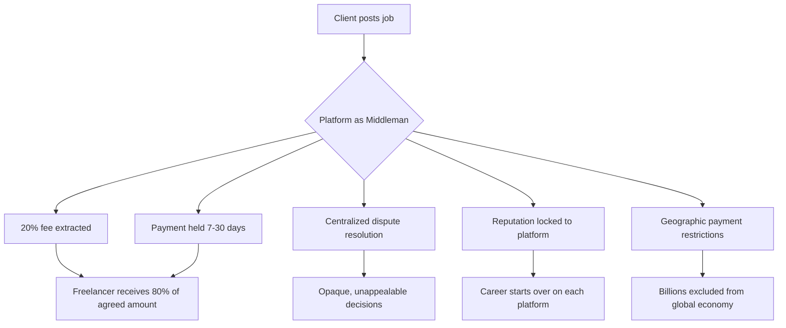

---

## 3. Why Traditional Freelancing Platforms Fail

### 3.1 The Fee Problem

| Platform | Freelancer Fee | Client Fee | Total Extraction |
|----------|---------------|------------|-----------------|
| Upwork | 5–20% (sliding scale) | 3% | Up to 23% |
| Fiverr | 20% | 5.5% | Up to 25.5% |
| Toptal | Undisclosed | ~15–20% | ~20%+ |
| Freelancer.com | 10% | 3% | Up to 13% |
| **ChainWork** | **0%** | **0%** | **0%** |

A freelancer billing $100,000/year on Upwork loses $15,000–20,000 to fees. Over a 10-year career, that is $150,000–200,000 in pure extraction — enough to buy a house in many markets.

### 3.2 The Payment Delay Problem

Traditional payment rails (ACH, SWIFT, PayPal) introduce systemic delays:
- US domestic transfer: 1–3 business days
- International wire: 3–10 business days
- PayPal international: 1–5 business days + conversion fees

Solana-based settlement is **immediate** (< 400ms block time) and costs fractions of a cent.

### 3.3 The Dispute Problem

When a dispute arises on a centralized platform:
1. Either party opens a ticket
2. A platform employee reviews (may take days to weeks)
3. Decision is made based on subjective assessment
4. Decision is **final** and **unappealable**
5. The platform's financial interest may bias the outcome

ChainWork replaces this with a **decentralized arbitration protocol** where disputes are resolved by a randomly selected jury of staked token holders, with outcomes recorded on-chain.

### 3.4 The Reputation Portability Problem

A freelancer with a 4.9-star rating and 500 jobs completed on Upwork has **zero portable reputation**. If they move to a competing platform, they start fresh. This platform lock-in is by design — it keeps workers captive and reduces competitive pressure on fees.

ChainWork's on-chain reputation protocol anchors reviews to the user's wallet address, not to the platform. This reputation is readable by any dApp, marketplace, or employer in the ecosystem.

---

## 4. The ChainWork Solution

### 4.1 Architecture Philosophy

ChainWork is built on three foundational principles:

1. **Trustlessness** — Replace institutional trust with cryptographic truth
2. **Openness** — All core primitives (escrow, reputation, identity) are open protocols
3. **Composability** — Build on Solana's ecosystem; let others build on ChainWork

### 4.2 The Hybrid Model

ChainWork intentionally bridges Web2 and Web3, recognizing that mass adoption requires meeting users where they are:

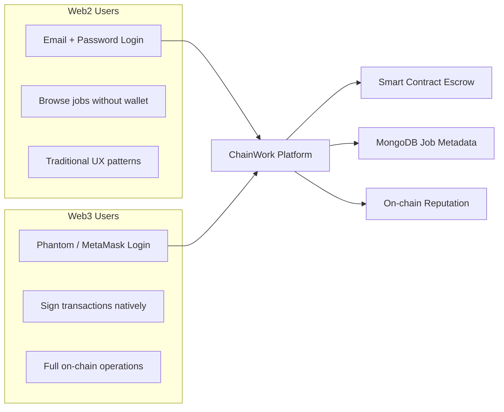

Web2 users can register with email/password and gradually adopt wallet functionality. Web3 natives can authenticate entirely via wallet signature — no email required.

### 4.3 The Zero-Fee Promise

ChainWork charges **0% on job payments**. This is possible because:

1. The escrow smart contract is **permissionless infrastructure** — it has no operating cost per transaction
2. Revenue is generated through **optional premium features**, not payment extraction
3. The protocol is designed to be **self-sustaining through token economics**

### 4.4 Value Flow Comparison

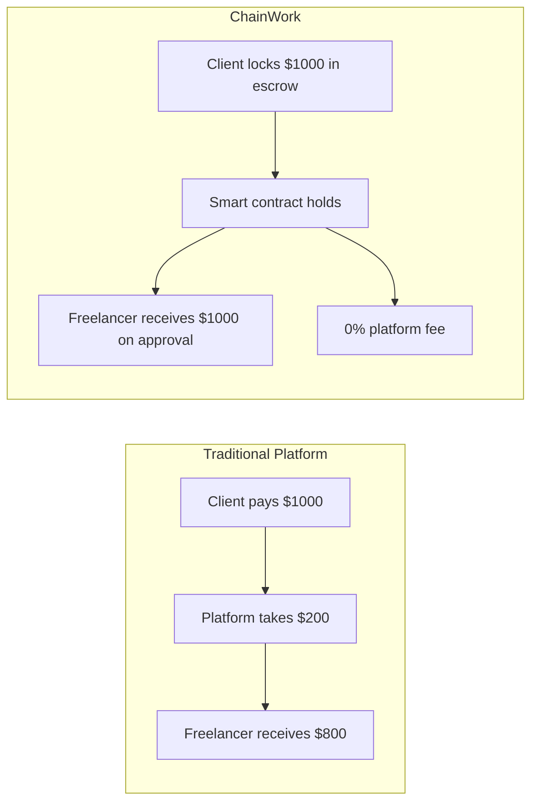

---

## 5. Core Features

### 5.1 Smart Contract Escrow

The heart of ChainWork is its **Solana-based escrow program** (`BKrfKJSFgPP1jvAZDLxQymwQYov8ktZntVdE9TBLHrLr`). When a client accepts a freelancer's proposal:

1. The client calls `InitializeSol` (or `InitializeToken` for SPL tokens)
2. Funds are transferred from the client's wallet into a **Program Derived Address (PDA)**
3. The PDA is mathematically derived from both parties' public keys — it is deterministic and unique to each client-freelancer pair
4. Funds are locked until either: (a) the client calls `ReleaseSol`, or (b) a dispute is resolved

No third party can access these funds. Not ChainWork. Not the validators. Only the parties to the contract, governed by the program's logic.

### 5.2 Multi-Chain Support

| Chain | Status | Token Support | Escrow |
|-------|--------|--------------|--------|
| Solana | ✅ Live | SOL, USDC, all SPL | Smart Contract PDA |
| Ethereum | 🔲 Q3 2026 | ETH, USDC, ERC-20 | Solidity Contract |
| Polygon | 🔲 Q4 2026 | MATIC, USDC | Solidity Contract |
| Arbitrum | 🔲 Q1 2027 | ETH (L2) | L2 Solidity Contract |

### 5.3 Hybrid Authentication

- **Option A:** Email + password (bcrypt-hashed, JWT-issued)
- **Option B:** Wallet signature challenge-response (Ed25519, tweetnacl)
- **Option C:** Both methods linked to same account

### 5.4 On-Chain Reputation

Reviews are cryptographically signed by the reviewer's wallet and anchored to the blockchain. The resulting trust score is:
- **Immutable** — cannot be deleted by the platform
- **Portable** — readable by any application querying the chain
- **Verifiable** — provably from a real, completed transaction

### 5.5 Dispute Resolution

When either party raises a dispute, the escrow enters a `Disputed` state. Resolution is handled by:
- **Phase 1:** Automated mediation via structured evidence submission
- **Phase 2:** Community jury selected from staked token holders
- **Phase 3:** On-chain vote → outcome enforced by smart contract

### 5.6 Milestone Payments

Jobs can be structured as multi-milestone contracts:
- Each milestone has its own escrow allocation
- Milestones are released independently
- Partial payment is possible on deliverable approval

---

## 6. Technical Architecture

### 6.1 System Overview

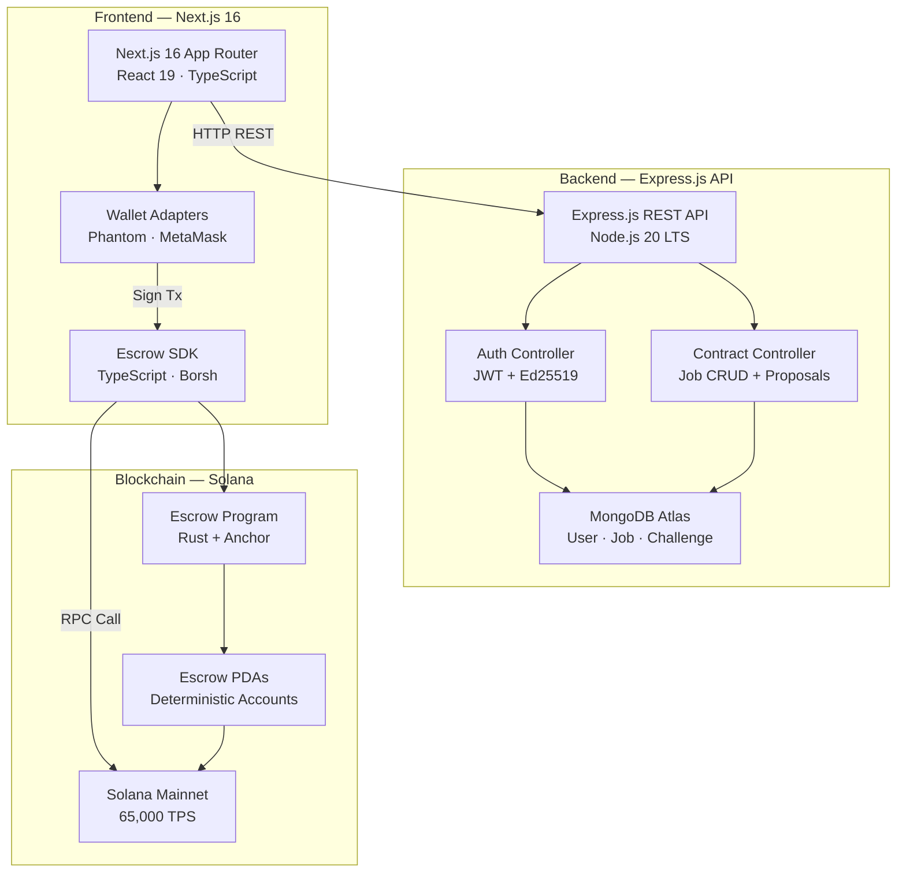

### 6.2 Technology Stack

**Frontend**

| Technology | Version | Purpose |
|------------|---------|---------|
| Next.js | 16.2.2 | App framework, SSR, routing |
| React | 19.2.4 | UI component library |
| TypeScript | ^5 | Type safety |
| Tailwind CSS | ^4 | Utility-first styling |
| Inter | — | Primary typography |
| Material Symbols | — | Icon system |
| Space Mono | — | Monospace for hashes/amounts |

**Backend**

| Technology | Version | Purpose |
|------------|---------|---------|
| Node.js | 20.x LTS | Runtime |
| Express.js | 4.18.2 | HTTP server |
| MongoDB Atlas | Cloud | Document database |
| Mongoose | 5.13.x | ODM |
| JWT | 8.x | Session tokens |
| bcryptjs | 2.4.x | Password hashing |
| tweetnacl | 1.0.x | Ed25519 sig verification |
| bs58 | 4.0.x | Base58 encoding |
| Helmet | 7.x | Security headers |

**Blockchain**

| Technology | Version | Purpose |
|------------|---------|---------|
| Solana | Mainnet | Primary chain |
| Anchor | 0.30 | Program framework |
| Rust | stable | Smart contract language |
| @solana/web3.js | 1.98.x | JavaScript SDK |
| @coral-xyz/borsh | 0.31.x | Instruction serialization |
| @solana/spl-token | 0.4.x | Token interactions |

### 6.3 Data Architecture

The system uses a **hybrid data model**: on-chain for financial state, off-chain for metadata.

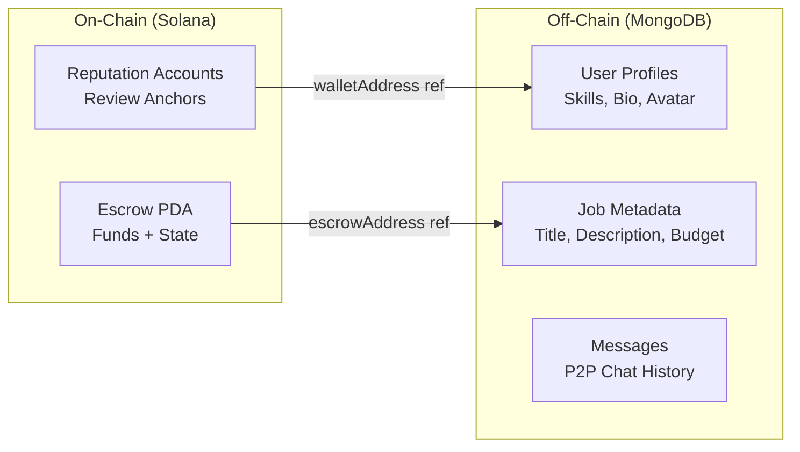

**On-chain data:** Escrow balances, escrow state, reputation anchors
**Off-chain data:** Job descriptions, user profiles, proposals, messages

This separation ensures:
- Gas efficiency (only critical financial state on-chain)
- Rich metadata without chain bloat
- Fast queries for marketplace browsing

---

## 7. Smart Contract Architecture

### 7.1 Program Overview

The ChainWork escrow program is a **native Solana program** written in Rust using the Anchor framework. It is deployed at:

```
Program ID: BKrfKJSFgPP1jvAZDLxQymwQYov8ktZntVdE9TBLHrLr
Network: Solana Devnet / Mainnet-Beta
Framework: Anchor 0.30
Language: Rust (stable)
```

### 7.2 Instruction Set

The program exposes 10 instructions via a `u8` discriminator byte:

| Discriminator | Instruction | Description |
|--------------|-------------|-------------|
| `0` | `InitializeSol` | Create SOL escrow, lock funds |
| `1` | `InitializeSolWithDeadline` | SOL escrow with expiry timestamp |
| `2` | `InitializeToken` | Create SPL token escrow |
| `3` | `InitializeTokenWithDeadline` | SPL token escrow with expiry |
| `4` | `Accept` | Freelancer accepts the contract |
| `5` | `ReleaseSol` | Release SOL to freelancer |
| `6` | `ReleaseToken` | Release SPL tokens to freelancer |
| `7` | `CancelSol` | Cancel + refund SOL to client |
| `8` | `CancelToken` | Cancel + refund SPL tokens |
| `9` | `Dispute` | Raise dispute (arbitration) |

### 7.3 Escrow Account State

Each escrow is stored in a Program Derived Address (PDA):

```rust
pub struct EscrowAccount {
    pub initializer:  Pubkey,        // Client who funded the escrow
    pub freelancer:   Pubkey,        // Freelancer receiving payment
    pub amount:       u64,           // Locked amount (lamports / token units)
    pub is_accepted:  bool,          // Freelancer acceptance flag
    pub is_completed: bool,          // Work completion flag
    pub deadline:     Option<i64>,   // Optional Unix timestamp
    pub token_mint:   Option<Pubkey>,// SPL token mint (None = SOL)
    pub bump:         u8,            // PDA bump seed
}
```

### 7.4 PDA Derivation

Each escrow account's address is deterministically derived from both parties:

```
seeds = ["escrow", initializer_pubkey, freelancer_pubkey]
program = BKrfKJSFgPP1jvAZDLxQymwQYov8ktZntVdE9TBLHrLr
```

This ensures:
- **Uniqueness** — one escrow per client-freelancer pair
- **Determinism** — address can be computed client-side before creation
- **Trustlessness** — no registry or admin required

### 7.5 Instruction Flow Architecture

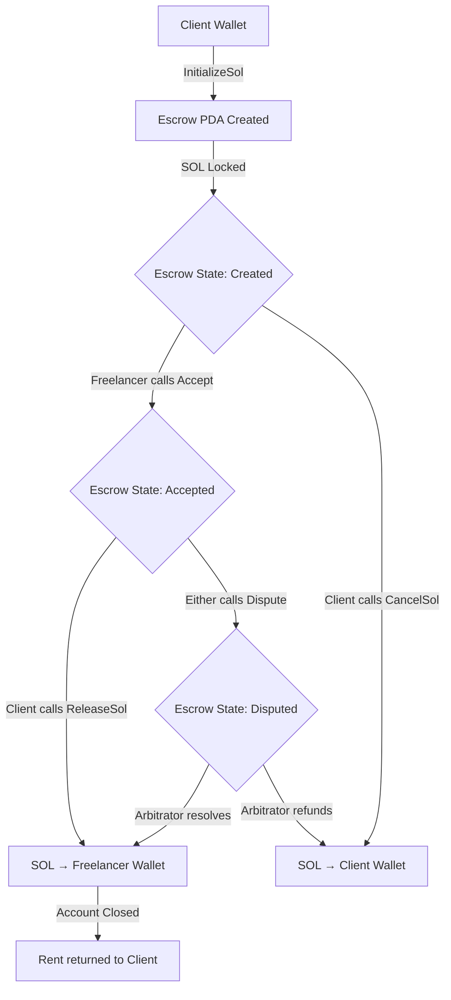

---

## 8. Escrow Lifecycle

### 8.1 Full Lifecycle Sequence

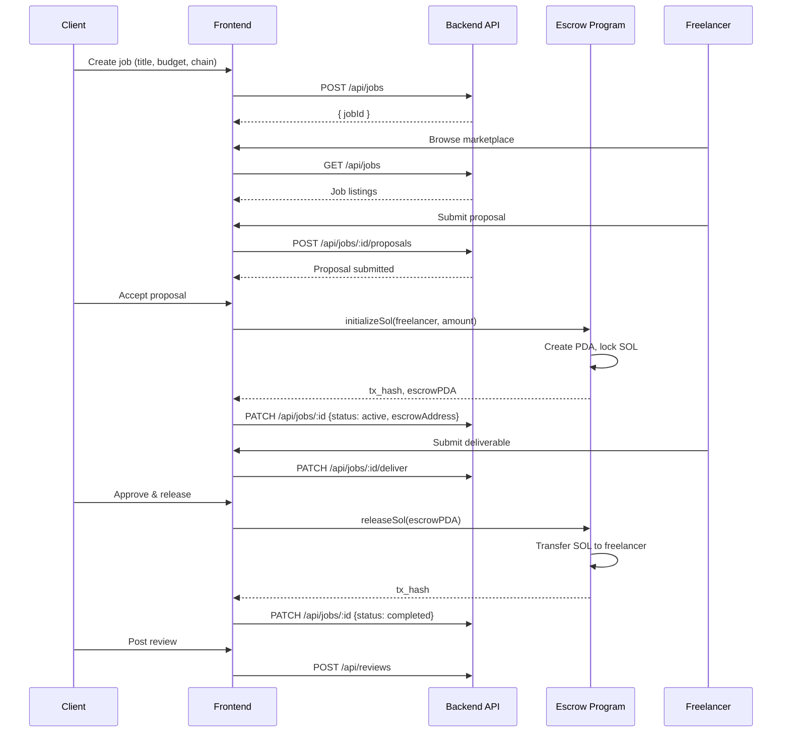

### 8.2 State Machine

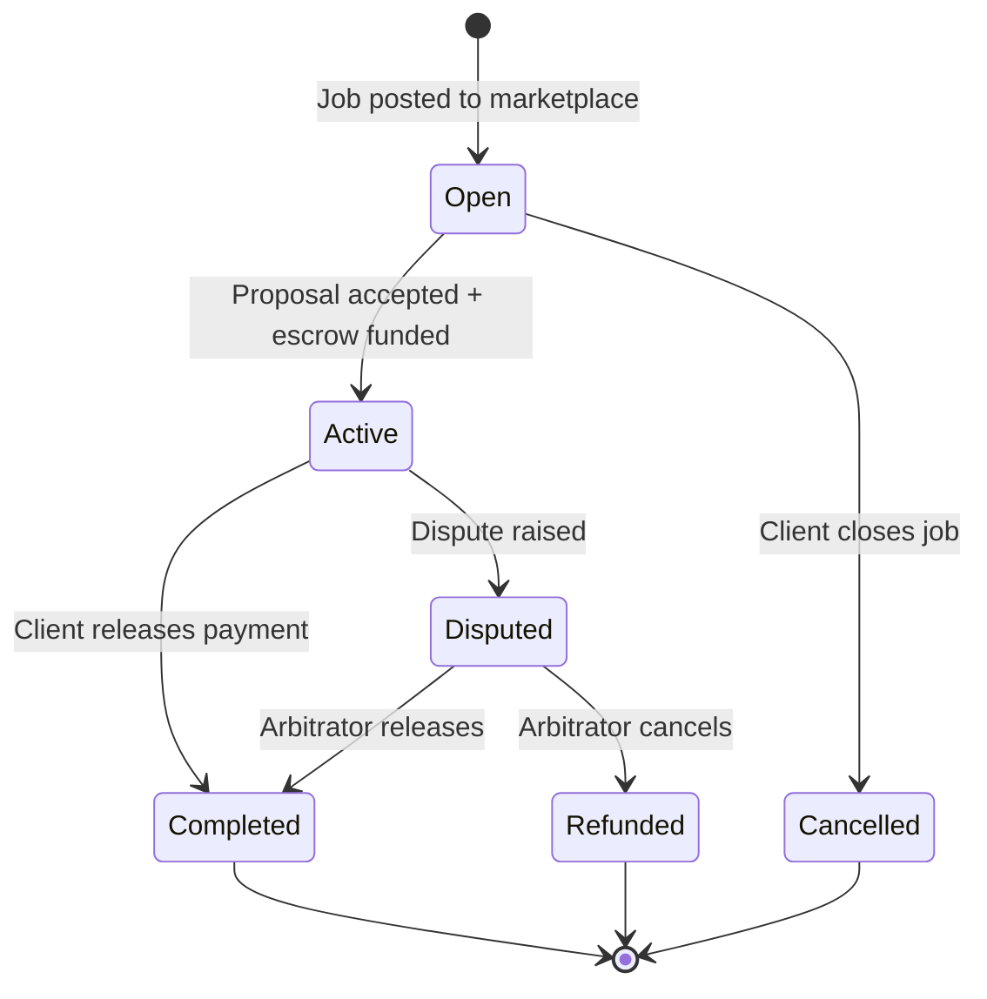

### 8.3 Deadline-Locked Escrows

For time-sensitive projects, clients can create deadline-locked escrows:

1. Client calls `InitializeSolWithDeadline` with Unix timestamp
2. If the deadline passes without release or dispute:
   - Either party can trigger auto-cancellation
   - SOL is returned to the client
   - Freelancer can contest via dispute mechanism

### 8.4 SPL Token Payments

ChainWork natively supports any SPL token for payment:

- **USDC** — Stable, predictable payment amounts
- **SOL** — Native chain token
- **Future:** Any verified SPL token added via governance vote

When using token payments, the program creates an **Associated Token Account (ATA)** owned by the PDA to hold the tokens, ensuring the same security guarantees as SOL escrows.

---

## 9. Security Model

### 9.1 Threat Model

ChainWork's security model identifies and mitigates the following threat classes:

| Threat | Vector | Mitigation |
|--------|--------|------------|
| Unauthorized fund release | Wrong signer calls Release | Signer authority check on every instruction |
| Double-spend | Same escrow funded twice | PDA uniqueness guarantees one account per pair |
| Replay attacks | Reusing signed transactions | Solana blockhash TTL (~2 min expiry) |
| Rug pulls | Client removes funds mid-job | PDA ownership — only program can move funds |
| Front-running | MEV on release transactions | Solana's deterministic transaction ordering |
| Admin key compromise | No admin key exists | Fully trustless after deployment |
| Deadline manipulation | Oracle attacks on timestamp | Uses on-chain `Clock` sysvar, not external oracle |
| Token theft | Unauthorized ATA access | SPL Token authority checks on all token instructions |

### 9.2 Smart Contract Security

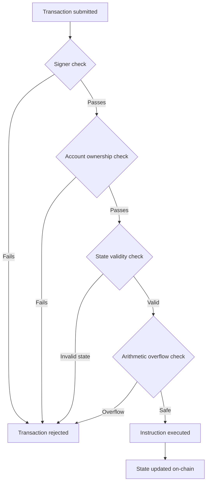

### 9.3 Backend Security Layers

| Layer | Measure | Implementation |
|-------|---------|---------------|
| Transport | HTTPS enforced | TLS via reverse proxy |
| Headers | Security hardening | Helmet middleware |
| Auth | Stateless JWT | 7-day TTL, signed HS256 |
| Passwords | Bcrypt hashing | 10 salt rounds |
| Wallet auth | Ed25519 verification | tweetnacl library |
| Rate limiting | 100 req/15 min | express-rate-limit |
| Challenge TTL | Auto-expiry | MongoDB TTL index (5 min) |
| CORS | Allowlist | Frontend origin only |
| Secrets | Env isolation | .env (gitignored) |

### 9.4 Audit Plan

Prior to mainnet deployment with real user funds:
1. **Internal audit** — Security review by core team
2. **Third-party audit** — Engagement with Soteria, OtterSec, or Neodyme
3. **Bug bounty** — Open program via Immunefi
4. **Devnet battle-testing** — 90-day public devnet phase

---

## 10. Authentication System

### 10.1 Dual Authentication Architecture

ChainWork supports two distinct authentication flows, both issuing JWT tokens for session management:

**Flow A — Email/Password**

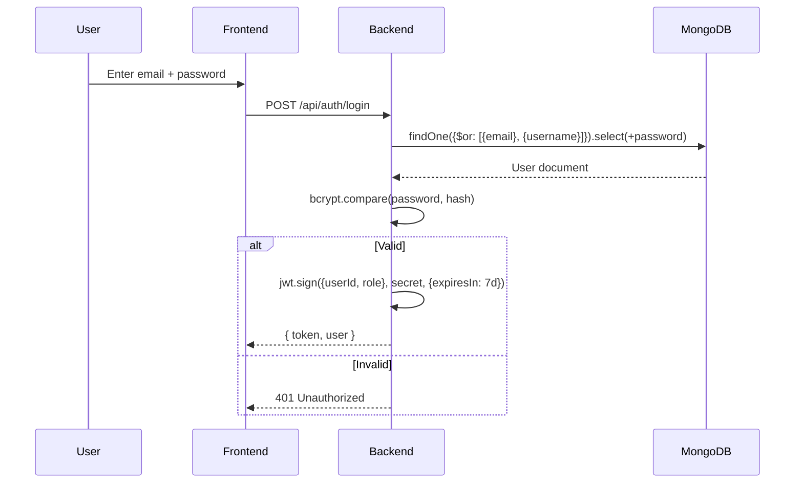

**Flow B — Wallet Signature (Ed25519)**

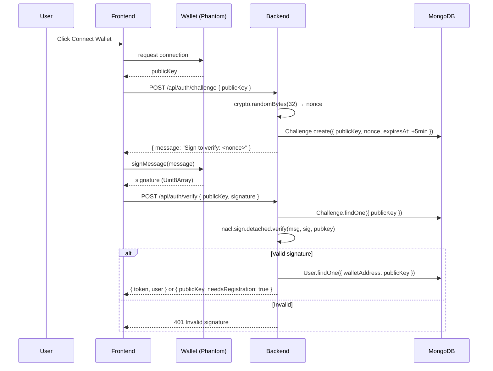

### 10.2 JWT Token Structure

```json
{
  "header": { "alg": "HS256", "typ": "JWT" },
  "payload": {
    "userId": "ObjectId",
    "role": "freelancer | client",
    "walletAddress": "Solana pubkey (optional)",
    "iat": 1714000000,
    "exp": 1714604800
  }
}
```

### 10.3 Security Properties

| Property | Implementation |
|----------|---------------|
| Challenge uniqueness | Cryptographically random 32-byte nonce |
| Replay prevention | 5-minute challenge TTL with MongoDB TTL index |
| Signature algorithm | Ed25519 (tweetnacl, industry standard for Solana) |
| Token expiry | 7-day JWT; must re-authenticate after |
| Multi-method account | Single user document links email + wallet |

---


## 11. Blockchain Infrastructure

The choice of underlying blockchain infrastructure is critical to the success of a decentralized application that requires high throughput and low transaction costs. ChainWork selected Solana as its primary and initial deployment environment after evaluating multiple Layer 1 and Layer 2 solutions.

### 11.1 The Blockchain Trilemma and Freelance Marketplaces

Freelancing marketplaces process micro-transactions, contract deployments, and frequent state updates. The infrastructure must solve the blockchain trilemma (decentralization, security, and scalability) with a strong emphasis on scalability and low fees.

| Network | Avg TPS | Avg Tx Cost | Finality Time | Escrow Viability |
|---------|---------|-------------|---------------|-------------------|
| Ethereum (L1) | 15 | ~$5.00 - $30.00 | ~15 mins | Unviable for micro-jobs |
| Polygon (PoS) | 30 | ~$0.01 - $0.05 | ~2 secs | Viable (Secondary choice) |
| Arbitrum (L2) | 40,000 | ~$0.10 - $0.20 | ~1 sec | Viable for larger jobs |
| **Solana (L1)** | **65,000** | **~$0.00025** | **~400 ms** | **Optimal** |

### 11.2 Why Solana?

ChainWork's architecture leverages Solana's unique technical advantages:

**1. Sealevel Runtime (Parallel Processing)**
Unlike EVM-compatible chains that process transactions sequentially, Solana's Sealevel runtime can process tens of thousands of smart contracts in parallel. Because ChainWork's escrow contracts (PDAs) do not have overlapping state with one another, multiple clients and freelancers can interact with their respective contracts simultaneously without network congestion.

**2. Predictable, Sub-cent Fees**
Traditional marketplaces charge 20% in fees. If a blockchain charges high gas fees, it defeats the purpose of an intermediary-free platform. Solana's sub-cent fees mean that even for a $50 micro-job, the blockchain transaction fee is negligible ($0.00025), preserving the freelancer's earnings.

**3. State Compression for Reputation (Planned)**
Solana's state compression (originally designed for compressed NFTs) allows ChainWork to store thousands of verified reviews and reputation scores on-chain at a fraction of the cost of traditional account storage. This enables a rich, on-chain reputation graph without bloat.

**4. Ecosystem Tooling**
The Anchor framework (Rust) provides robust security and standardization for smart contract development. Combined with the `@solana/web3.js` library, it enables seamless frontend integration for a smooth Web2-like user experience.

### 11.3 RPC Architecture and Redundancy

To ensure maximum uptime and prevent endpoint throttling during high-traffic periods, ChainWork employs a multi-tiered RPC architecture:

- **Primary RPC:** Helius (Optimized for fast reads and reliable transaction broadcasting)
- **Fallback RPC:** QuickNode (Automatically swaps if primary latency exceeds 500ms)
- **Local Cache:** Redis cache on the Node.js backend to serve non-critical read requests (e.g., global stats) without hitting the RPC.

---

## 12. Multi-Chain Expansion Strategy

While Solana offers the best initial environment, the future of Web3 is multi-chain. Freelancers and clients should not be restricted by their preferred network. ChainWork's architecture is designed to be chain-agnostic at the application layer, with a phased rollout to EVM-compatible networks.

### 12.1 Phase 1: Solana Native (Current)
- Escrow contracts written in Rust (Anchor).
- SPL Token integration (USDC, USDT, SOL).
- Ed25519 wallet signatures (Phantom, Backpack).
- Lowest friction, highest performance.

### 12.2 Phase 2: EVM Layer 2 Expansion (Q4 2026)
To capture the massive liquidity and user base of the Ethereum ecosystem without the prohibitive L1 gas fees, ChainWork will deploy Solidity-based escrow contracts on leading Layer 2 networks.

**Target Networks:**
1. **Polygon (PoS):** High adoption, low fees, massive existing user base.
2. **Arbitrum / Optimism:** High security derived from Ethereum L1, growing DeFi liquidity.

**Architecture Alignment:**
The ChainWork backend is designed to handle multiple chain contexts. The MongoDB schema includes a `chainNetwork` field for every job, dictating which smart contract ABI and RPC endpoint the frontend should use.

```javascript
// Job Schema Example
{
  jobId: "job_12345",
  title: "Full Stack Next.js Dev",
  chainNetwork: "polygon", // or 'solana', 'arbitrum'
  contractAddress: "0x...", // EVM Contract or Solana PDA
  tokenMint: "0x3c499c542cEF5E3811e1192ce70d8cC03d5c3359" // USDC on Polygon
}
```

### 12.3 Phase 3: Cross-Chain Settlement (2027)
The ultimate goal is abstracting the chain entirely from the user experience using intent-based cross-chain protocols (like Wormhole or LayerZero).
- A client can fund an escrow on Ethereum (USDC).
- A freelancer can choose to withdraw the funds on Solana (USDC) upon completion.
- The cross-chain messaging protocol handles the bridging and settlement automatically in the background.

---

## 13. Tokenomics: The WORK Token

ChainWork introduces a native utility and governance token, **$WORK**, designed to align incentives between clients, freelancers, and the platform ecosystem. The token is not a fundraising vehicle, but a fundamental mechanism for decentralization and reputation staking.

### 13.1 Token Details
- **Token Name:** ChainWork
- **Ticker:** WORK
- **Network:** Solana (SPL Token)
- **Total Supply:** 1,000,000,000 (1 Billion) WORK
- **Initial Circulating Supply:** 150,000,000 WORK

### 13.2 Utility and Use Cases

1. **Governance & Voting:** Staked WORK tokens grant voting power in the ChainWork DAO, allowing users to vote on protocol upgrades, fee structures, and treasury grants.
2. **Dispute Resolution Staking:** Arbitrators (Jurors) must stake WORK to participate in the decentralized dispute resolution system. Successful arbitration yields rewards; malicious voting results in slashing.
3. **Reputation Boosting:** Freelancers can stake WORK against their own profiles to signal trust and boost their ranking in the search algorithm. Clients can stake WORK to signal high-intent hiring.
4. **Platform Fee Discounts:** While core escrow is free, premium features (like featured job listings, premium analytics) cost USDC. Paying with WORK provides a 25% discount.

### 13.3 Token Distribution

The 1 Billion WORK supply is allocated to ensure long-term sustainability and community ownership:

| Category | Allocation | Percentage | Vesting Schedule |
|----------|------------|------------|------------------|
| **Community Rewards** | 350,000,000 | 35% | 5-year linear emission based on platform usage |
| **DAO Treasury** | 200,000,000 | 20% | Unlocked, managed by DAO governance |
| **Core Contributors** | 150,000,000 | 15% | 1-year cliff, 3-year linear vesting |
| **Investors & Backers** | 150,000,000 | 15% | 1-year cliff, 2-year linear vesting |
| **Ecosystem Grants** | 100,000,000 | 10% | Distributed based on milestone achievement |
| **Public Sale / Liquidity** | 50,000,000 | 5% | 100% unlocked at TGE |

### 13.4 Deflationary Mechanics
To counteract the emission of community rewards, ChainWork implements sinks:
- **Dispute Slashing:** Tokens slashed from bad actors in disputes are burned.
- **Premium Feature Burn:** 50% of all WORK tokens spent on premium platform features (e.g., promoted listings) are burned, reducing total supply.

---

## 14. Governance Model

ChainWork aims to progressively decentralize its operations, transitioning from a core development team to a fully autonomous DAO governed by its users. The **ChainWork DAO** ensures that the platform cannot unilaterally change fee structures or rules to the detriment of its users.

### 14.1 Progressive Decentralization

- **Phase 1 (Months 1-12):** Core team controls the protocol parameters via a multi-sig wallet. DAO votes act as strong signals but are non-binding.
- **Phase 2 (Months 12-24):** Introduction of the Governance Module. Binding on-chain votes for treasury allocation and minor protocol parameter changes.
- **Phase 3 (Month 24+):** Full decentralization. Smart contract upgrades and all protocol fees are directly controlled by on-chain voting.

### 14.2 Voting Weight and veWORK

To prevent whales or exchanges from dominating governance, ChainWork uses a Vote-Escrowed (ve) model. Users must lock their WORK tokens to gain voting power.

- Lock for 1 month: 1 WORK = 1 veWORK
- Lock for 6 months: 1 WORK = 2 veWORK
- Lock for 1 year: 1 WORK = 4 veWORK

This ensures that governance decisions are made by long-term stakeholders who are aligned with the platform's success.

### 14.3 Proposal Types

1. **Parameter Proposals:** Changing platform parameters (e.g., juror reward amounts, slashing penalties). Requires 5% quorum, 51% approval.
2. **Treasury Proposals:** Granting funds from the DAO treasury to ecosystem developers or marketing initiatives. Requires 10% quorum, 60% approval.
3. **Core Protocol Upgrades:** Upgrading the underlying smart contracts. Requires 20% quorum, 75% approval and a 7-day timelock.

---

## 15. DAO Architecture and Sub-DAOs

To ensure efficient operation, the ChainWork DAO is structured into specialized Sub-DAOs (or Committees). This prevents voter fatigue on minor decisions while maintaining democratic oversight.

### 15.1 The Council

The ChainWork Council is a multi-sig group of 7 elected representatives serving 6-month terms. They are responsible for emergency interventions (e.g., pausing the contract in case of an exploit) and executing complex off-chain tasks that the DAO approves.

### 15.2 The Dispute Committee

A specialized sub-DAO composed of high-reputation freelancers and clients. They oversee the parameters of the decentralized arbitration system, such as defining acceptable evidence formats and tuning the jury selection algorithm.

### 15.3 The Grants Committee

Responsible for reviewing applications from developers building tools, integrations, or plugins for the ChainWork ecosystem. They have a discretionary monthly budget allocated by the main DAO and do not require a full DAO vote for small grants (under $10,000 equivalent).

### 15.4 Tooling

The ChainWork DAO utilizes standard Solana governance infrastructure:
- **Realms:** For proposal creation, voting, and treasury management.
- **Squads:** For multi-sig operations by the elected Council and Committees.

By utilizing established governance tools, ChainWork ensures a secure, auditable, and familiar governance experience for its stakeholders.


## 16. Reputation System

A decentralized marketplace is only as strong as its trust mechanisms. Without a centralized authority to verify users, ChainWork relies on a robust, cryptographically verifiable, on-chain reputation system.

### 16.1 The Trust Score Protocol

Unlike traditional 5-star rating systems that are easily manipulated by fake accounts (Sybil attacks), the ChainWork Trust Score requires cryptographic proof of real economic activity.

**Trust Score Components:**
1. **Economic Weight:** A review's weight is proportional to the size of the escrowed job. A $5,000 completed job carries 100x more weight than a $50 job.
2. **Time Decay:** Older reviews gradually lose weight, ensuring the score reflects the freelancer's current performance and active status.
3. **Reviewer Reputation:** Reviews left by clients with high Trust Scores carry more weight than reviews from new, unverified clients.

### 16.2 On-Chain Verification

When a job concludes, both parties sign their reviews with their wallet's private key. The review payload includes:
- The Job ID
- The Escrow PDA address (proof of funds locked)
- The Transaction Hash of the final release
- The Rating (1-100 scale) and Text

This payload is hashed and committed to the blockchain, ensuring it cannot be altered or deleted. The actual text is stored off-chain (IPFS or MongoDB) but its hash is immutable on-chain.

### 16.3 Sybil Resistance

To prevent users from creating fake accounts and hiring themselves to boost their reputation:
- **Transaction Costs:** Completing a fake job requires paying network fees.
- **Identity Staking (Optional):** Users can link centralized identities (GitHub, LinkedIn) or use decentralized identity solutions (Civic pass) to receive a "Verified" badge, drastically increasing their initial baseline trust score and the weight of their reviews.
- **Velocity Limits:** The algorithm detects and discounts rapid, repetitive transactions between the same two wallet addresses.

---

## 17. Marketplace Mechanics

ChainWork operates a dual-sided marketplace consisting of Clients (demand) and Freelancers (supply). The core workflow is designed to minimize friction while maximizing transparency.

### 17.1 Job Posting and Discovery

1. **Job Creation:** Clients post jobs detailing requirements, skills, budget, and desired blockchain network. The job is broadcast to the marketplace index.
2. **Algorithmic Matching:** The ChainWork backend utilizes an Elasticsearch index to surface jobs to relevant freelancers based on tag overlap, past job history, and preferred budget ranges.
3. **Proposals:** Freelancers submit proposals containing their bid amount, timeline, cover letter, and an on-chain reference to their Trust Score.

### 17.2 The Proposal Lifecycle

When reviewing proposals, clients are presented with a unified dashboard. Every proposal clearly displays the freelancer's wallet address, Trust Score, and a link to their verifiable on-chain history.

- `PENDING`: The proposal is active.
- `ACCEPTED`: The client selects the proposal. This triggers the frontend to prompt the client's wallet to initialize and fund the escrow smart contract.
- `REJECTED`: The client dismisses the proposal.
- `ACTIVE`: The escrow is funded. The job officially begins. The job status on the marketplace updates to prevent further proposals.

### 17.3 Search and Ranking Algorithm

To ensure high-quality matches, the search algorithm heavily weights:
- **Verifiable History:** Freelancers with completed on-chain jobs matching the required skills are prioritized.
- **Staked WORK:** Freelancers who have staked WORK tokens receive a ranking multiplier, serving as a signal of long-term commitment to the platform.
- **Client Verification:** Jobs posted by clients with established history or verified identities rank higher in the freelancer feed.

---

## 18. Revenue Model

A zero-fee marketplace seems counterintuitive to traditional business models. However, ChainWork generates sustainable revenue by monetizing value-added services and ecosystem features, rather than taxing core peer-to-peer labor transactions.

### 18.1 Core Principle: Free Labor Exchange
ChainWork will **never** take a percentage of the freelancer's earnings. If a client agrees to pay $1,000, the freelancer receives exactly $1,000 (minus network gas fees).

### 18.2 Premium Services (Revenue Streams)

1. **Premium Listings ($9.99 / job):** Clients can pay to pin their job postings to the top of search results and targeted email digests for 7 days.
2. **Verified Identity Badge ($4.99 / month):** A subscription service that uses third-party KYC providers to grant a verified badge, boosting trust and search ranking.
3. **ChainWork Pro Analytics ($19.99 / month):** Advanced analytics for agencies and top freelancers, showing proposal conversion rates, market rate suggestions, and competitor insights.
4. **Enterprise Accounts ($49.99 / month):** Multi-seat accounts for agencies allowing team collaboration, role-based access control, and bulk escrow management.
5. **Dispute Resolution Premium (1% of disputed amount):** While standard decentralized arbitration is free (paid via inflation/staking), users can pay a premium for expedited, expert resolution.

### 18.3 Financial Projections

Based on a conservative user acquisition model, targeting the Web3 native niche first before expanding to Web2:

| Year | Active Users | Expected GMV | Platform Revenue |
|------|--------------|--------------|------------------|
| 2026 | 10,000       | $5M          | $120,000         |
| 2027 | 75,000       | $50M         | $1,200,000       |
| 2028 | 300,000      | $250M        | $6,000,000       |
| 2029 | 800,000      | $800M        | $20,000,000      |
| 2030 | 2,000,000    | $2.5B        | $60,000,000      |

*Revenue assumes an average ARPU of $30 per year from optional premium services across the user base.*

---

## 19. Fee Structure Details

Clarity regarding fees is paramount for building trust. ChainWork categorizes fees into network costs (unavoidable) and platform costs (optional).

### 19.1 Network Transaction Costs (Gas)

Users interact directly with the blockchain and must pay the requisite network fees. These fees do not go to ChainWork; they go to network validators.

- **Solana (Current):** ~$0.00025 per transaction. Negligible for all users.
- **Polygon (Future):** ~$0.01 per transaction.
- **Ethereum L1 (Future):** Variable, $5 - $50. Recommended only for enterprise-level contracts exceeding $10,000.

*Note: ChainWork plans to implement "gasless" meta-transactions using relayers for Solana and Polygon in Q4 2026, where the platform subsidizes the micro-fees for premium users to provide a seamless Web2 experience.*

### 19.2 Paying for Premium Features

Users can pay for the optional premium services (outlined in Section 18) using either stablecoins (USDC) or the native WORK token.

To drive utility and demand for the native token, all platform fees paid in **WORK receive an automatic 25% discount.**

| Feature | Cost in USDC | Cost in WORK Equivalent |
|---------|--------------|-------------------------|
| Premium Listing | $9.99 | $7.49 |
| Pro Analytics | $19.99 | $14.99 |

---

## 20. Freelancer Incentives: Earn-to-Own

Traditional platforms treat freelancers as products. ChainWork treats them as owners. The "Earn-to-Own" model distributes ownership of the protocol to the users who generate value for it.

### 20.1 The Reward Pool
As detailed in the Tokenomics section, 35% of the total WORK supply is dedicated to community rewards. These tokens are emitted over a 5-year schedule specifically to reward platform activity.

### 20.2 Earning Mechanisms

Freelancers automatically earn WORK tokens by hitting specific milestones, essentially mining the token through their labor:

1. **First Completed Job:** 500 WORK (One-time bonus)
2. **Volume Rewards:** 200 WORK for every $1,000 USDC earned through the platform.
3. **Reputation Streaks:** 2,000 WORK bonus for receiving 10 consecutive 5-star reviews on jobs over $100.
4. **Dispute-Free Completion:** Small fractional bonuses for completing jobs without triggering the arbitration process.

### 20.3 Loyalty Tiers and Multipliers

To retain top talent, ChainWork implements loyalty tiers based on lifetime earnings on the platform. Higher tiers grant multipliers on WORK token rewards:

| Tier | Lifetime Earnings | Reward Multiplier | Extra Benefits |
|------|-------------------|-------------------|----------------|
| Bronze | $0 - $1,000 | 1.0x | Standard access |
| Silver | $1,001 - $10,000 | 1.25x | Profile highlight |
| Gold | $10,001 - $50,000 | 1.50x | Priority customer support |
| Platinum | $50,000+ | 2.0x | DAO voting bonus, direct API access |

This structure strongly incentivizes freelancers to keep their clients on-platform rather than taking relationships offline, as the long-term value of earning WORK tokens outweighs the non-existent platform fees.


## 21. Staking Mechanism

The ChainWork staking protocol allows WORK token holders to lock their tokens in a smart contract to secure the network, participate in governance, and earn yields. This reduces circulating supply while rewarding long-term believers in the ecosystem.

### 21.1 Staking Tiers and Yields

Staking yield (APY) is dynamically calculated based on the total amount staked across the network, but users can boost their individual APY by committing to longer lock-up periods.

| Tier | Min Stake | Lock Period | Target APY | Governance Multiplier |
|------|-----------|-------------|------------|-----------------------|
| Flexible | 100 WORK | None (3-day unbond) | 4% | 1x |
| Standard | 1,000 WORK | 30 days | 8% | 1.5x |
| Extended | 10,000 WORK | 90 days | 14% | 3x |
| Validator | 100,000 WORK | 365 days | 20% | 5x |

### 21.2 Sources of Staking Yield

Traditional DeFi platforms often rely purely on inflationary token emissions to pay stakers, which is unsustainable. ChainWork aims for "Real Yield" by supplementing emissions with actual protocol revenue:

1. **Token Emission:** A portion of the 35% Community Rewards pool is directed to stakers.
2. **Dispute Resolution Fees:** Users who pay for expedited arbitration generate revenue, 30% of which goes to stakers.
3. **Premium Feature Revenue:** 20% of the USDC revenue generated from Premium Listings and Verified Badges is used to market-buy WORK tokens and distribute them to stakers.

### 21.3 Slashing Conditions

Staking in ChainWork carries responsibilities, particularly for those participating as Jurors in the Dispute Resolution system. To ensure honest behavior, staked tokens can be slashed (burned):

- **Juror Non-Participation:** If selected for a jury and failing to vote within the 72-hour window: **2% Slash**.
- **Provable Fraud / Collusion:** If the DAO Council mathematically proves a coordinated attack or bribery ring among jurors: **25% Slash + Permanent Blacklist**.
- **Governance Manipulation:** Using flash loans or exploits to swing votes: **100% Slash**.

---

## 22. Treasury System

A well-capitalized treasury is essential for the long-term survival and growth of the protocol, funding everything from marketing campaigns to vital security audits.

### 22.1 Treasury Composition and Management

At launch, the ChainWork Treasury holds 200,000,000 WORK tokens (20% of supply). Over time, it will diversify its holdings by retaining a portion of the USDC revenue generated from platform features.

The Treasury is managed by the DAO. No single founder or developer holds the private keys. It is controlled by a multi-sig wallet requiring execution approval from the elected Council, following successful on-chain DAO votes.

### 22.2 Fund Allocation Strategy

To ensure sustainable growth, the DAO operates under a target allocation framework:

- **40% - Developer Grants:** Funding external teams building integrations, mobile apps, or cross-chain bridges.
- **25% - Marketing & Growth:** Acquiring traditional Web2 users through campaigns, sponsorships, and referral incentives.
- **15% - Security & Audits:** Continuous bug bounties and bi-annual third-party smart contract audits.
- **10% - WORK Buyback & Burn:** Periodically purchasing WORK from the open market to create deflationary pressure.
- **10% - Emergency Reserve:** Maintained in USDC, untouched unless a catastrophic exploit requires user reimbursement.

### 22.3 The Grants Program

The lifeblood of the ecosystem. Any developer can submit a proposal to the Grants Committee. 
- **Tier 1 (Up to $5,000):** Quick approval for small plugins, translations, or community events.
- **Tier 2 (Up to $50,000):** Requires full committee review. For substantial infrastructure or major platform integrations.
- **Tier 3 ($50,000+):** Requires a full DAO token-holder vote. Reserved for core protocol expansions.

---

## 23. Dispute Resolution System

Disputes are an unavoidable reality in any freelance marketplace. Clients may be unhappy with the deliverables, or freelancers may feel scope creep has occurred. Traditional platforms use centralized, slow, and biased customer support teams. ChainWork replaces this with a decentralized, cryptographically secure arbitration protocol.

### 23.1 The Dispute Lifecycle

1. **Initiation:** Either party triggers the `InitializeDispute` instruction on the escrow PDA, pausing the release of funds. A small fee (in WORK) must be staked to prevent spam.
2. **Evidence Phase (48 Hours):** Both parties upload evidence (chat logs, Figma links, GitHub commits). The evidence is hashed and anchored on-chain.
3. **Jury Selection:** The protocol uses a Verifiable Random Function (VRF) to select a jury from the pool of eligible, staked WORK holders.
4. **Deliberation (72 Hours):** Jurors review the evidence and cast anonymous votes on-chain.
5. **Execution:** Once the voting period ends, the smart contract automatically tallies the votes and executes the transaction (releasing to freelancer, refunding client, or a 50/50 split).

### 23.2 Jury Selection and VRF

To prevent collusion, jurors must be selected randomly, unpredictably, and transparently. ChainWork uses Chainlink VRF (or Solana native equivalents like Switchboard) to select the jury.

- **Small Disputes (< $1,000):** 5 Jurors.
- **Large Disputes (≥ $1,000):** 9 Jurors.

Jurors are selected based on their reputation and the amount of WORK they have staked. They are unaware of who the other jurors are until the vote concludes.

### 23.3 Incentives and the Schelling Point

Jurors are incentivized to vote honestly based on the concept of a Schelling Point. 
- If a juror votes with the majority, they receive a reward (paid from the dispute fee and inflation).
- If a juror votes against the majority, they receive no reward. 
- Consistent contrarian voting degrades their "Juror Score," eventually excluding them from the profitable jury pool.

### 23.4 Appeals Process

If a party strongly disagrees with the verdict, they can trigger an appeal within 48 hours by posting a much larger bond (e.g., 500 WORK). This summons a "Supreme Jury" of 15 highly ranked arbitrators. If the appeal succeeds, the bond is returned with a bonus. If it fails, the bond is burned.

---

## 24. AI Integration Roadmap

While ChainWork's foundation is built on blockchain, its future user experience will be powered by Artificial Intelligence. The intersection of verifiable on-chain data and AI models presents massive opportunities for optimization.

### 24.1 AI-Powered Matching Engine (Q3 2027)

Currently, job discovery relies on basic keyword and tag filtering. In the future, ChainWork will implement an ML-based recommendation engine.
- **For Freelancers:** The AI analyzes their past completed on-chain jobs, GitHub commits, and profile text to build a specialized skill vector, matching them with jobs they are statistically likely to win.
- **For Clients:** The AI scores incoming proposals based on the freelancer's historical success rate with similar prompts, filtering out spam or unqualified bids.

### 24.2 AI Dispute Assistant (2028)

Human juries are expensive and slow. The AI Dispute Assistant aims to resolve 50% of disputes before they ever reach a human.
- When a dispute is triggered, an LLM analyzes the original job description, the submitted deliverables, and the chat history.
- It provides a preliminary, unbiased ruling recommendation to both parties.
- If both parties accept the AI's ruling, the dispute is resolved instantly, saving time and jury fees. If rejected, it proceeds to the human jury, who can view the AI's analysis as supplemental context.

### 24.3 Smart Contract Auditing AI (Planned)

To lower the barrier to entry for multi-chain expansion, ChainWork plans to integrate AI tools that automatically scan community-submitted escrow contracts for common vulnerabilities before they are approved by the DAO.

---

## 25. SDK & Developer Ecosystem

ChainWork is not just an application; it is an infrastructure layer. By open-sourcing its core escrow logic, ChainWork allows other developers to build specialized marketplaces on top of its secure foundation.

### 25.1 The ChainWork TypeScript SDK

The `@chainwork/escrow-sdk` allows any Web3 or Web2 application to implement trustless escrow payments in minutes.

```typescript
import { EscrowClient, Network } from '@chainwork/escrow-sdk';

// Initialize the client on Solana
const client = new EscrowClient(connection, Network.SOLANA);

// Create a trustless escrow for a design asset
const txHash = await client.createEscrow({
  payer: clientWallet,
  payee: designerWallet,
  amount: 500, // USDC
  tokenMint: USDC_MINT,
  arbitration: true 
});
```

### 25.2 Third-Party Integrations

By providing a robust API and SDK, ChainWork enables novel use cases:
- **Design Tools:** A Figma plugin where clients can lock funds directly within the design file; funds release automatically when the final design is approved.
- **Code Repositories:** A GitHub integration that automatically releases milestone payments when a Pull Request is merged into the `main` branch.
- **Gaming:** Esports platforms using ChainWork to escrow tournament prize pools automatically distributed based on API results.

### 25.3 Developer Grants and Hackathons

To bootstrap this ecosystem, 40% of the DAO Treasury is earmarked for developer grants. ChainWork will actively sponsor and participate in global hackathons (like Solana Breakpoint and ETHGlobal) to encourage developers to build the next generation of decentralized labor tools using the ChainWork SDK.


## 26. API Infrastructure

For ChainWork to become the underlying infrastructure for decentralized labor, its API must be robust, secure, and developer-friendly. The backend is built on a modern Node.js/Express stack, designed for high availability and low latency.

### 26.1 RESTful Architecture

The ChainWork API follows strict RESTful principles, providing predictable resource-oriented URLs.

**Core Endpoints:**
- `/api/auth/*`: Handles registration, login (JWT), and Web3 wallet signature challenges.
- `/api/jobs/*`: CRUD operations for job postings, including advanced filtering and pagination.
- `/api/proposals/*`: Managing freelancer bids and client acceptances.
- `/api/users/*`: Profile management, reputation history, and portfolio updates.
- `/api/escrow/*`: Read-only endpoints that sync on-chain escrow states with the off-chain database.

### 26.2 Authentication and Security

The API implements a dual-layer security model to accommodate both Web2 and Web3 users:
1. **JWT (JSON Web Tokens):** For traditional email/password users, granting stateless session management.
2. **Ed25519 Wallet Signatures:** For Web3 users. The backend issues a unique cryptographic challenge. The user signs it with their private key (e.g., via Phantom wallet). The backend verifies the signature, proving ownership of the address, and issues a standard JWT for subsequent API calls.

All endpoints are protected by rate limiting, helmet security headers, and strict CORS policies to prevent abuse and XSS attacks.

### 26.3 Real-time Synchronization (WebSockets)

Freelancing platforms require immediate feedback. ChainWork utilizes WebSockets (via Socket.io) to provide real-time updates for:
- In-app messaging between clients and freelancers.
- Instant notifications when a proposal is submitted or accepted.
- Live status updates when an on-chain escrow transaction is confirmed.

---

## 27. Scalability Plan

As ChainWork grows from thousands to millions of users, the infrastructure must scale seamlessly without degrading user experience or compromising decentralization.

### 27.1 Database Sharding and Caching

The primary database is MongoDB Atlas. To handle massive read/write volumes:
- **Sharding:** Job listings and historical proposals will be sharded across multiple clusters based on geographic region and industry categories, ensuring fast query times regardless of data size.
- **Redis Caching:** High-traffic, read-heavy endpoints (like the global job feed) are cached in Redis with a 30-second TTL. This drastically reduces database load and provides sub-50ms response times for users browsing the marketplace.

### 27.2 Frontend Edge Delivery

The Next.js frontend is deployed globally utilizing a Content Delivery Network (CDN) and Edge computing. Static assets and pre-rendered pages are served from the node closest to the user, ensuring near-instant load times globally, a crucial feature for freelancers in developing nations with slower internet connections.

### 27.3 Blockchain RPC Scaling

Interacting with the blockchain at scale requires dedicated infrastructure. ChainWork utilizes a load-balanced pool of premium RPC nodes. If Solana experiences network congestion, the system automatically falls back to secondary nodes. Furthermore, "read" operations (like checking a user's token balance) are handled entirely by localized caching layers rather than querying the blockchain directly for every page load.

---

## 28. Roadmap 2026–2028

The development and rollout of ChainWork is structured into four distinct phases, prioritizing security and core functionality before expanding into governance and AI.

### 28.1 Phase 1: Foundation (Q1–Q2 2026)
*Focus: Delivering the core decentralized marketplace experience.*
- ✅ Finalize Smart Contract Architecture (Solana/Rust).
- ✅ Develop Next.js 16 Frontend and Node.js Backend.
- ✅ Implement Hybrid Authentication (Web2 + Web3).
- 🔄 Deploy to Solana Devnet for internal testing.
- 🔲 Complete comprehensive third-party security audits.
- 🔲 Launch Closed Beta (500 curated users).

### 28.2 Phase 2: Launch & TGE (Q3–Q4 2026)
*Focus: Going live and establishing the token economy.*
- 🔲 **Solana Mainnet Launch.**
- 🔲 **WORK Token Generation Event (TGE).**
- 🔲 Launch Public Beta marketing campaign.
- 🔲 Implement Interim Dispute Resolution (Centralized council).
- 🔲 Deploy initial Polygon (EVM) integration.
- 🔲 Release the TypeScript Escrow SDK v1.0.

### 28.3 Phase 3: Decentralization & Expansion (2027)
*Focus: Handing power to the DAO and expanding the ecosystem.*
- 🔲 Launch Decentralized Arbitration (WORK Jury System).
- 🔲 Implement the DAO Governance Voting Module.
- 🔲 Release Native iOS and Android Mobile Applications.
- 🔲 Integrate Arbitrum L2 for broader Ethereum ecosystem access.
- 🔲 Launch the AI-Powered Matching Engine v1.

### 28.4 Phase 4: Autonomy & Domination (2028)
*Focus: Becoming the global standard for freelance infrastructure.*
- 🔲 Full handover of protocol control to the DAO.
- 🔲 Deploy the AI Dispute Assistant to automate minor conflicts.
- 🔲 Establish Enterprise Client Accounts with advanced compliance tooling.
- 🔲 Cross-Chain Universal Escrow Bridge implementation.

---

## 29. Go-To-Market Strategy

Building great technology is only half the battle; acquiring users in a two-sided marketplace requires a highly targeted approach to solve the "cold start" problem.

### 29.1 The "Wedge" Strategy: Web3 Natives First

ChainWork will not immediately market to traditional freelancers (e.g., graphic designers on Fiverr). Instead, the initial target audience is **Web3 Native Developers, Auditors, and Crypto Startups**.
- **Why?** These users already have wallets, understand gas fees, and possess high intent for secure, on-chain payments. They experience the most pain with traditional platforms that ban crypto-related jobs.

### 29.2 Client Acquisition Tactics

1. **DAO Partnerships:** Partnering directly with major DAOs (e.g., MakerDAO, Uniswap) to process their contractor bounties through ChainWork, bringing immediate high-value demand to the platform.
2. **Zero-Fee Promise:** A relentless marketing campaign highlighting the 20% savings compared to Upwork. "Pay the talent, not the platform."
3. **Hackathon Sponsorships:** Sponsoring tracks at major Solana and Ethereum hackathons to introduce the platform directly to the target demographic.

### 29.3 Freelancer Acquisition Tactics

1. **Earn-to-Own:** Emphasizing the WORK token rewards. Freelancers aren't just working; they are earning equity in the platform they use.
2. **Referral Program:** A robust on-chain referral system paying WORK tokens to users who bring in active clients or high-quality freelancers.
3. **Influencer Marketing:** Partnering with prominent developer-focused YouTubers and Crypto Twitter personalities to demonstrate the escrow functionality.

---

## 30. Partnerships Strategy

Strategic partnerships are vital for scaling utility and credibility. ChainWork actively seeks integrations across the Web3 stack.

### 30.1 Infrastructure Partners

- **Wallet Providers (Phantom, Backpack, MetaMask):** Deep linking integrations to ensure a seamless signing experience on mobile and desktop.
- **RPC Providers (Helius, QuickNode):** Enterprise-tier agreements to ensure uninterrupted blockchain interaction.

### 30.2 Financial Partners

- **Stablecoin Issuers (Circle, Paxos):** Integrating direct fiat-to-USDC on-ramps within the ChainWork UI via Stripe or MoonPay, allowing traditional clients to fund escrows with a credit card without needing to understand crypto exchanges.
- **DeFi Protocols (Jupiter, Uniswap):** Allowing freelancers to auto-swap their USDC earnings into other assets or auto-stake their WORK tokens immediately upon payment release.

### 30.3 Community Partners

- **Developer Bootcamps:** Partnering with Web3 bootcamps to provide graduates with their first verifiable on-chain jobs, bootstrapping their reputation.
- **Identity Protocols (Civic, Worldcoin):** Integrating optional identity verification to provide the "Verified" badge, reducing Sybil attacks and increasing trust for enterprise clients.


## 31. Legal & Compliance

Operating a global marketplace involving cryptocurrency requires a proactive and rigorous approach to legal compliance. ChainWork is designed with regulatory frameworks in mind from day one, mitigating legal risk for both the platform and its users.

### 31.1 Marketplace, Not a Money Transmitter

A critical distinction in the ChainWork architecture is that **the platform never takes custody of user funds.**
The smart contracts operate on a peer-to-peer basis. ChainWork provides the user interface and the code, but the escrow is a direct technological interaction between the client and the freelancer. By never acting as a financial intermediary, ChainWork significantly reduces its regulatory burden regarding money transmission licenses (e.g., FinCEN in the US).

### 31.2 KYC / AML Strategy

While pure wallet-to-wallet transactions remain pseudonymous, ChainWork implements Know Your Customer (KYC) and Anti-Money Laundering (AML) protocols at key interaction points:
- **Fiat On/Off Ramps:** Any integration allowing users to purchase USDC with fiat currency requires standard KYC, handled entirely by third-party payment processors (e.g., MoonPay, Stripe).
- **Enterprise Tiers:** Clients utilizing the Enterprise tier or spending above $10,000 equivalent must pass corporate verification to prevent the platform from being used for large-scale money laundering.
- **Sanctions Monitoring:** The frontend UI and the API layer actively monitor connected wallets against the OFAC sanctions list, blocking addresses associated with illicit activity.

### 31.3 Token Classification (WORK)

Extensive legal structuring ensures the WORK token is classified as a **Utility Token**, not a security.
- It does not represent equity, debt, or a claim on company profits.
- It is functionally required to participate in the decentralized arbitration system (staking).
- Governance rights are strictly limited to protocol parameter adjustments, not corporate decisions.
- A comprehensive legal opinion from a leading Web3 law firm will be published prior to the TGE.

---

## 32. Risks & Mitigations

Transparency regarding potential risks is essential for a Web3 protocol. ChainWork has identified key risks across technical, market, and operational vectors and implemented robust mitigation strategies.

### 32.1 Technical Risks

| Risk Category | Description | Mitigation Strategy |
|---------------|-------------|---------------------|
| **Smart Contract Exploit** | A bug in the escrow logic allowing theft of locked funds. | Bi-annual audits by Tier-1 firms (e.g., Zellic, OtterSec). $500k ongoing bug bounty program. Staged mainnet rollout. |
| **Network Outage** | Solana network experiences degradation or downtime. | Multi-chain expansion (Polygon/Arbitrum) provides alternatives. Graceful UI degradation; off-chain DB retains state until the network recovers. |
| **Data Breach** | MongoDB database containing user emails and chat logs is compromised. | Strict data encryption at rest. Zero-knowledge architecture where possible; sensitive data is never stored on the blockchain. |

### 32.2 Market & Economic Risks

| Risk Category | Description | Mitigation Strategy |
|---------------|-------------|---------------------|
| **Vampire Attacks** | Competitor forks the open-source contracts and offers higher token rewards. | Deep network effects through the proprietary off-chain matching engine, established client relationships, and accumulated on-chain reputation. |
| **Token Volatility** | Extreme price swings in the WORK token destabilize the reward system. | Core job payments are strictly in stablecoins (USDC). Token rewards are dynamically adjusted based on moving averages to maintain consistent USD-equivalent value. |

### 32.3 Operational Risks

| Risk Category | Description | Mitigation Strategy |
|---------------|-------------|---------------------|
| **Dispute Collusion** | Jurors collude off-chain to steal funds through fraudulent voting. | VRF-based anonymous jury selection. Massive slashing penalties (25%+) for proven collusion. The Appeals system allows a wider pool to review suspicious verdicts. |
| **Regulatory Crackdown** | Sweeping anti-crypto legislation impacts the ability to operate. | Geofencing capabilities to restrict access in non-compliant jurisdictions. Maintaining strict non-custodial status. |

---

## 33. Competitive Analysis

The freelance marketplace sector is highly competitive, but traditional incumbents suffer from massive technical debt and extractive business models. ChainWork enters the market with distinct structural advantages.

### 33.1 Traditional Incumbents (Upwork, Fiverr)
- **The Problem:** They charge 20% fees, hold funds in centralized bank accounts subject to arbitrary freezing, and suffer from high rates of platform leakage (users taking relationships offline).
- **The ChainWork Advantage:** 0% fees, cryptographic proof of payment (trustless escrow), and incentives (Earn-to-Own) that keep users on the platform.

### 33.2 Web3 Competitors

**Braintrust:**
- *Model:* Takes a 10% fee from clients (0% from freelancers).
- *Weakness:* Still relies on centralized dispute resolution and fiat banking for escrow. The token model is largely a rebate system rather than true infrastructure.
- *ChainWork Advantage:* Truly trustless escrow via smart contracts, zero fees for *both* parties, and decentralized arbitration.

**Dework / Gitcoin:**
- *Model:* Excellent tools for DAO bounty management.
- *Weakness:* Lack robust, dispute-capable escrow for complex, long-term contracts. Primarily focused on open-source software, ignoring the broader gig economy (design, marketing, legal).
- *ChainWork Advantage:* A focus on traditional, 1-on-1 freelance contracts with a comprehensive arbitration system, built to scale beyond the Web3 developer niche.

---

## 34. Future Vision

ChainWork is not just building a marketplace; it is building the foundational infrastructure for the future of decentralized labor.

### 34.1 The Open Labor Protocol

Within 5 years, the vision is for the "ChainWork" marketplace UI to be just one of many applications built on top of the **ChainWork Protocol**. 
- Specialized frontend interfaces (e.g., a marketplace just for 3D artists, or a private agency portal) will plug into the ChainWork escrow and reputation smart contracts.
- Users will carry their ChainWork Trust Score across the entire internet, utilizing it as a decentralized resume and proof-of-work identity.

### 34.2 Real-World Asset (RWA) Integration

As blockchain adoption permeates traditional finance, ChainWork will expand beyond digital deliverables. The escrow SDK will be utilized for physical services (e.g., construction contractors, event planning), integrating with IoT devices and oracle networks to verify real-world milestone completion.

### 34.3 The Autonomous Global Workforce

Ultimately, ChainWork envisions a world where geographic location and banking infrastructure no longer dictate economic opportunity. A developer in emerging markets will have the exact same cryptographic guarantee of payment as a developer in Silicon Valley, seamlessly transacting in a borderless, permissionless, and fair global economy.

---

## 35. Conclusion

The modern freelance economy is stifled by middlemen who extract immense value while providing minimal security. Traditional platforms solve the "trust problem" through centralized control, punishing users with exorbitant fees, arbitrary account suspensions, and exclusionary banking requirements.

**ChainWork fundamentally rewrites this equation.**

By replacing the corporate middleman with immutable smart contracts, ChainWork achieves what was previously impossible: a trustless, global marketplace with zero commission fees. 

The integration of Solana's high-speed infrastructure, a robust hybrid authentication system, and a decentralized arbitration protocol creates a platform that is not only fairer but technologically superior to the incumbents. Furthermore, the WORK token aligns the incentives of all participants, transforming freelancers from mere users into active stakeholders in the network's success.

The tools for the next evolution of human coordination are here. The market demands a fairer system. 

**ChainWork is ready to build it.**


---

## Appendix A: Glossary of Terms

Understanding ChainWork requires familiarity with both freelancing concepts and blockchain terminology. This glossary provides clear, plain-English definitions for all key terms used throughout this whitepaper.

| Term | Definition |
|------|-----------|
| **Anchor** | A framework for writing Solana smart contracts in Rust. Provides safety checks, serialization, and IDL generation, making contract development faster and more secure. |
| **Arbitration** | The process of resolving a dispute between a client and freelancer. In ChainWork, this is done by a randomly selected jury of staked WORK token holders. |
| **Borsh** | Binary Object Representation Serializer for Hashing — the serialization format used by Solana for encoding instruction data sent to smart contracts. |
| **Cold Start Problem** | The challenge of launching a two-sided marketplace (like a freelance platform) when both buyers and sellers need each other to be present before the platform has value. |
| **CPI (Cross-Program Invocation)** | A Solana mechanism that allows one smart contract program to call instructions on another smart contract program. Used in ChainWork to interact with the SPL Token program. |
| **DAO (Decentralized Autonomous Organization)** | An organization governed by smart contracts and token holder votes rather than a traditional corporate hierarchy. ChainWork's governance model is a DAO. |
| **Ed25519** | A public-key signature algorithm used by Solana. Wallets use Ed25519 keypairs. The signature algorithm is used in ChainWork's Web3 authentication flow. |
| **Escrow** | A legal arrangement where a third party holds funds until a specific condition is met. In ChainWork, this "third party" is replaced by a deterministic smart contract. |
| **Gas** | The fee paid to blockchain network validators for processing a transaction. On Solana, this is called a "transaction fee" and is extremely low (~$0.00025). |
| **GMV (Gross Merchandise Value)** | The total monetary value of all services transacted through the ChainWork marketplace within a given period. A key platform health metric. |
| **IDL (Interface Definition Language)** | A JSON file generated by the Anchor framework that describes the structure of a Solana program's instructions and accounts. Used by the ChainWork SDK to interact with the contract. |
| **Juror** | A WORK token staker selected by Verifiable Random Function (VRF) to evaluate evidence and vote on dispute outcomes. |
| **Lamport** | The smallest unit of SOL (Solana's native currency). 1 SOL = 1,000,000,000 Lamports. ChainWork's `InitializeSol` instruction receives amount in lamports. |
| **Multi-sig** | A wallet or account that requires multiple parties to sign a transaction before it executes. Used by the ChainWork Council to prevent single points of failure in governance. |
| **PDA (Program Derived Address)** | A special Solana account address that is deterministically generated from a program ID and seed bytes. Has no private key, so only the program can sign for it. Used as ChainWork's escrow vault. |
| **RPC (Remote Procedure Call)** | An endpoint that ChainWork's frontend and backend use to communicate with the Solana blockchain. ChainWork uses Helius as its primary RPC provider. |
| **Schelling Point** | A concept in game theory describing a solution people tend to choose by default in absence of communication. Used in ChainWork's jury incentive design: honest jurors converge on the same verdict. |
| **Slashing** | The destruction (burning) of a staker's tokens as punishment for malicious behavior. In ChainWork, jurors who behave dishonestly face slashing of their staked WORK. |
| **SPL Token** | Solana Program Library Token — the standard for creating fungible tokens on Solana, equivalent to ERC-20 on Ethereum. USDC on Solana is an SPL token. WORK will be an SPL token. |
| **Trust Score** | ChainWork's proprietary reputation metric (0–1000) combining completed job history, review weight, economic volume, and on-chain verification signals. |
| **TGE (Token Generation Event)** | The moment when the WORK token is officially created and distributed. Not an "ICO" in the traditional sense — tokens are distributed based on usage, not speculation. |
| **Trustless** | A system where participants do not need to trust each other or a third party because the rules are enforced by code (smart contracts). |
| **veWORK** | Vote-Escrowed WORK — a non-transferable token received when locking WORK for governance. More veWORK = more governance voting power. |
| **VRF (Verifiable Random Function)** | A cryptographic primitive that produces a random output with a proof that the output was generated correctly. Used for unpredictable, tamper-proof jury selection in ChainWork disputes. |
| **Wallet Adapter** | A JavaScript library that allows ChainWork's Next.js frontend to communicate with browser-based wallets like Phantom or Backpack. |


---

## Appendix B: Smart Contract Technical Reference

### B.1 Program Details

| Property | Value |
|----------|-------|
| **Program ID** | `BKrfKJSFgPP1jvAZDLxQymwQYov8ktZntVdE9TBLHrLr` |
| **Framework** | Anchor 0.29 |
| **Language** | Rust 1.75 |
| **Network** | Solana Devnet (Mainnet: Q3 2026) |
| **Token Standard** | SPL Token (USDC, SOL Native) |

### B.2 Account Structure

The escrow PDA account stores the following state on-chain:

```rust
#[account]
pub struct EscrowAccount {
    /// The public key of the client who initialized the escrow
    pub initializer: Pubkey,         // 32 bytes
    /// The public key of the freelancer receiving funds on completion
    pub taker: Pubkey,               // 32 bytes
    /// Amount of lamports (SOL) locked in escrow
    pub expected_amount: u64,        // 8 bytes
    /// Bump seed for deterministic PDA derivation
    pub bump: u8,                    // 1 byte
    /// Off-chain job ID for linking escrow to MongoDB record
    pub job_id: [u8; 32],            // 32 bytes
    /// Unix timestamp when escrow was initialized
    pub created_at: i64,             // 8 bytes
    /// Dispute flag — true if either party raised a dispute
    pub disputed: bool,              // 1 byte
}
// Total account space: 8 (discriminator) + 114 bytes = 122 bytes
```

### B.3 Instruction Set

**`initialize_sol`** — Create and fund a SOL escrow

```rust
pub fn initialize_sol(
    ctx: Context<InitializeSol>,
    amount: u64,
    job_id: [u8; 32],
) -> Result<()>
```
- Transfers `amount` lamports from `initializer` to the PDA vault.
- Writes escrow state to the PDA account.
- Emits `EscrowInitialized` event.

**`release_sol`** — Release funds to the freelancer

```rust
pub fn release_sol(ctx: Context<ReleaseSol>) -> Result<()>
```
- Can only be called by the `initializer` (client).
- Cannot be called if `disputed == true`.
- Transfers all lamports from PDA vault to `taker`.
- Closes the PDA account, returning rent to `initializer`.

**`cancel_sol`** — Refund the client

```rust
pub fn cancel_sol(ctx: Context<CancelSol>) -> Result<()>
```
- Can only be called by the `initializer`.
- Cannot be called if `disputed == true` or if the freelancer has already acknowledged acceptance.
- Returns lamports to `initializer`.

**`raise_dispute`** — Freeze funds pending arbitration

```rust
pub fn raise_dispute(ctx: Context<RaiseDispute>) -> Result<()>
```
- Can be called by either `initializer` or `taker`.
- Sets `disputed = true`, preventing release or cancellation.
- Emits `DisputeRaised` event monitored by the backend arbitration service.

**`resolve_dispute`** — Arbitration verdict execution

```rust
pub fn resolve_dispute(
    ctx: Context<ResolveDispute>,
    freelancer_pct: u8,  // 0–100, percentage going to freelancer
) -> Result<()>
```
- Can only be called by the designated Dispute Authority PDA (controlled by the on-chain Arbitration Program).
- Splits lamports according to `freelancer_pct` and sends to both parties.

### B.4 PDA Derivation

```typescript
// TypeScript — deriving the escrow PDA address
const [escrowPDA, bump] = PublicKey.findProgramAddressSync(
  [
    Buffer.from("escrow"),
    clientPublicKey.toBuffer(),
    freelancerPublicKey.toBuffer(),
    Buffer.from(jobId),           // 32-byte job identifier
  ],
  ESCROW_PROGRAM_ID
);
```

### B.5 Security Invariants

The following security properties are enforced at the smart contract level and cannot be bypassed by the UI or backend:

1. **Only the initializer can release or cancel** — enforced via `has_one = initializer` constraint.
2. **Funds cannot be withdrawn while disputed** — enforced via `require!(!escrow.disputed, ...)` check.
3. **PDA cannot be signed by any external key** — PDAs have no private key; only the program can move their funds.
4. **Overflow protection** — Rust's integer overflow causes a panic (transaction failure) in debug mode; production builds use checked arithmetic.
5. **Rent exemption** — All escrow accounts are initialized with enough lamports to be rent-exempt, preventing automatic deletion.


---

## Appendix C: Database Schema Reference

ChainWork's off-chain data layer uses MongoDB Atlas. The schema is designed for flexibility (document model) while enforcing critical constraints via Mongoose validators.

### C.1 User Document

```json
{
  "_id": "ObjectId",
  "username": "string (unique, required)",
  "email": "string (unique, sparse)",
  "passwordHash": "string (bcrypt, nullable for wallet-only users)",
  "walletAddress": "string (Solana pubkey, unique, sparse)",
  "role": "enum: ['client', 'freelancer', 'both']",
  "profile": {
    "fullName": "string",
    "avatar": "string (IPFS hash or URL)",
    "bio": "string (max 500 chars)",
    "skills": ["string"],
    "hourlyRate": "number (USDC)",
    "portfolio": [{ "title": "string", "url": "string" }],
    "location": "string",
    "timezone": "string (IANA tz)"
  },
  "reputation": {
    "trustScore": "number (0-1000)",
    "totalJobsCompleted": "number",
    "totalEarned": "number (USDC)",
    "reviewCount": "number",
    "averageRating": "number (1-5)"
  },
  "workToken": {
    "balance": "number",
    "lifetimeEarned": "number",
    "loyaltyTier": "enum: ['bronze','silver','gold','platinum']"
  },
  "authChallenges": [{
    "nonce": "string",
    "expiresAt": "Date (TTL indexed, 5 min)",
    "used": "boolean"
  }],
  "isVerified": "boolean",
  "kycStatus": "enum: ['none','pending','approved','rejected']",
  "createdAt": "Date",
  "updatedAt": "Date"
}
```

### C.2 Job Document

```json
{
  "_id": "ObjectId",
  "title": "string (required)",
  "description": "string (required, max 5000 chars)",
  "client": "ObjectId (ref: User)",
  "requiredSkills": ["string"],
  "budget": {
    "min": "number (USDC)",
    "max": "number (USDC)",
    "type": "enum: ['fixed','hourly']"
  },
  "chainNetwork": "enum: ['solana','polygon','arbitrum']",
  "escrow": {
    "pdaAddress": "string (Solana PDA or EVM contract address)",
    "transactionHash": "string (initialization tx)",
    "amount": "number (USDC or native token)",
    "status": "enum: ['unfunded','funded','released','refunded','disputed']"
  },
  "status": "enum: ['draft','open','active','completed','cancelled','disputed']",
  "proposals": ["ObjectId (ref: Proposal)"],
  "acceptedProposal": "ObjectId (ref: Proposal, nullable)",
  "timeline": {
    "postedAt": "Date",
    "deadline": "Date",
    "completedAt": "Date (nullable)"
  },
  "tags": ["string"],
  "viewCount": "number",
  "attachments": [{ "name": "string", "url": "string", "hash": "string" }]
}
```

### C.3 Proposal Document

```json
{
  "_id": "ObjectId",
  "job": "ObjectId (ref: Job)",
  "freelancer": "ObjectId (ref: User)",
  "bidAmount": "number (USDC)",
  "estimatedDays": "number",
  "coverLetter": "string (max 1000 chars)",
  "status": "enum: ['pending','accepted','rejected','withdrawn']",
  "walletAddress": "string (freelancer pubkey at submission time)",
  "submittedAt": "Date"
}
```

### C.4 Dispute Document

```json
{
  "_id": "ObjectId",
  "job": "ObjectId (ref: Job)",
  "raisedBy": "ObjectId (ref: User)",
  "respondent": "ObjectId (ref: User)",
  "escrowPDA": "string",
  "status": "enum: ['evidence','jury_selection','deliberation','resolved','appealed']",
  "evidence": [{
    "submittedBy": "ObjectId (ref: User)",
    "type": "enum: ['text','link','file']",
    "content": "string",
    "contentHash": "string (sha256, anchored on-chain)",
    "submittedAt": "Date"
  }],
  "jury": [{
    "jurorWallet": "string",
    "vote": "enum: ['freelancer','client','split', null]",
    "votedAt": "Date (nullable)"
  }],
  "verdict": {
    "freelancerPct": "number (0-100)",
    "resolutionTx": "string (on-chain resolution tx hash)",
    "resolvedAt": "Date"
  },
  "disputeStakeBurned": "number (WORK)",
  "createdAt": "Date"
}
```

---

## Appendix D: API Endpoint Reference

Complete reference for all ChainWork REST API endpoints. Base URL: `https://api.chainwork.io/v1`

### D.1 Authentication Endpoints

| Method | Path | Auth | Description |
|--------|------|------|-------------|
| `POST` | `/auth/register` | None | Register with email + password |
| `POST` | `/auth/login` | None | Login, receive JWT |
| `POST` | `/auth/challenge` | None | Generate wallet auth nonce |
| `POST` | `/auth/verify-wallet` | None | Submit signed challenge, receive JWT |
| `POST` | `/auth/link-wallet` | JWT | Link wallet to existing email account |
| `POST` | `/auth/refresh` | JWT (exp) | Refresh an expiring JWT |
| `DELETE` | `/auth/logout` | JWT | Invalidate current session |

### D.2 Job Endpoints

| Method | Path | Auth | Description |
|--------|------|------|-------------|
| `GET` | `/jobs` | Optional | List jobs with filters & pagination |
| `POST` | `/jobs` | JWT (client) | Create a new job posting |
| `GET` | `/jobs/:id` | Optional | Get single job with full details |
| `PATCH` | `/jobs/:id` | JWT (owner) | Update job title, description, or status |
| `DELETE` | `/jobs/:id` | JWT (owner) | Soft-delete a draft job |
| `GET` | `/jobs/:id/proposals` | JWT (owner) | List all proposals for a job |
| `POST` | `/jobs/:id/proposals` | JWT (freelancer) | Submit a new proposal |
| `PATCH` | `/jobs/:id/proposals/:pid` | JWT (owner) | Accept or reject a proposal |

### D.3 User & Profile Endpoints

| Method | Path | Auth | Description |
|--------|------|------|-------------|
| `GET` | `/users/:id` | Optional | Public profile + trust score |
| `PATCH` | `/users/me` | JWT | Update own profile |
| `GET` | `/users/me/jobs` | JWT | List jobs posted or worked |
| `GET` | `/users/me/earnings` | JWT | Lifetime earnings + WORK balance |
| `POST` | `/users/me/staking` | JWT | Initiate WORK stake transaction |

### D.4 Dispute Endpoints

| Method | Path | Auth | Description |
|--------|------|------|-------------|
| `POST` | `/disputes` | JWT | Raise a dispute for an active job |
| `GET` | `/disputes/:id` | JWT (party) | Get dispute details |
| `POST` | `/disputes/:id/evidence` | JWT (party) | Submit evidence |
| `GET` | `/disputes/jury` | JWT (juror) | List pending juries for staker |
| `POST` | `/disputes/:id/vote` | JWT (juror) | Submit jury vote |

### D.5 Error Response Format

All errors follow a standardized format:

```json
{
  "success": false,
  "error": {
    "code": "ESCROW_ALREADY_FUNDED",
    "message": "This job's escrow has already been funded and cannot be modified.",
    "details": {}
  },
  "timestamp": "2026-05-06T12:00:00Z",
  "requestId": "req_abc123"
}
```


---

## Appendix E: Security Audit Framework

Security is non-negotiable for a platform handling real financial transactions. ChainWork follows a multi-layered audit framework covering smart contracts, backend, and frontend.

### E.1 Smart Contract Audit Checklist

Before every mainnet deployment, the Anchor/Rust program must pass the following checklist:

| Category | Check | Status |
|----------|-------|--------|
| **Access Control** | All instructions validate signer against stored initializer/taker | ✅ |
| **PDA Safety** | All PDAs use canonical bumps (first valid bump) | ✅ |
| **Integer Arithmetic** | No unchecked addition/subtraction of lamport amounts | ✅ |
| **Account Validation** | All account constraints use Anchor's `#[account(...)]` macros | ✅ |
| **Reentrancy** | Solana's account model prevents reentrancy by design | ✅ |
| **Initialization** | Accounts cannot be re-initialized (Anchor discriminator check) | ✅ |
| **Rent Exemption** | All created accounts are rent-exempt | ✅ |
| **CPI Safety** | Only authorized programs can invoke ChainWork CPIs | 🔲 |
| **Upgrade Authority** | Program upgrade authority transferred to multisig before mainnet | 🔲 |

### E.2 Backend Security Checklist

| Category | Check | Implementation |
|----------|-------|---------------|
| **Authentication** | JWT signed with RS256 (asymmetric keys) | `jsonwebtoken`, `RS256` |
| **Password Hashing** | bcrypt with cost factor 12 | `bcryptjs` |
| **Wallet Signature** | Ed25519 verification via `tweetnacl` | `nacl.sign.detached.verify()` |
| **Rate Limiting** | 100 req/15min (public), 500 req/15min (authenticated) | `express-rate-limit` |
| **Input Validation** | All request bodies validated with `express-validator` | Schema-level validation |
| **Injection Prevention** | MongoDB query sanitization, no raw string interpolation | `mongo-sanitize` |
| **Security Headers** | HSTS, X-Frame-Options, CSP, X-Content-Type-Options | `helmet.js` |
| **CORS** | Strict whitelist of allowed origins | `cors` with `origin` array |
| **Environment Secrets** | All secrets in `.env`, never committed to Git | `.gitignore`, Doppler |

### E.3 Bug Bounty Program

ChainWork operates a public bug bounty program to incentivize responsible disclosure:

| Severity | Criteria | Reward |
|----------|----------|--------|
| **Critical** | Unauthorized fund extraction from any escrow | $50,000 – $500,000 |
| **High** | Authentication bypass or account takeover | $10,000 – $50,000 |
| **Medium** | Data leak exposing non-public user information | $1,000 – $10,000 |
| **Low** | UI/UX bugs, non-critical logic errors | $100 – $1,000 |

All reports submitted to `security@chainwork.io` are reviewed within 48 hours. Duplicate reports receive no reward; the first valid submission takes priority.

---

## Appendix F: Token Distribution Vesting Schedule

### F.1 Vesting Timeline (Month-by-Month for Year 1)

| Month | Core Contributors (15%) | Investors (15%) | Ecosystem Grants (10%) | Community Rewards (35%) | Circulating Supply |
|-------|------------------------|-----------------|----------------------|------------------------|-------------------|
| TGE | 0 | 0 | 10M | 5M | 65M (5% public + pre-TGE) |
| M+3 | 0 | 0 | 10M | 14.6M | 89.6M |
| M+6 | 0 | 0 | 10M | 14.6M | 114.2M |
| M+9 | 0 | 0 | 10M | 14.6M | 138.8M |
| M+12 | 12.5M (cliff) | 37.5M (cliff) | 10M | 14.6M | 213.4M |

*Community Rewards emit ~14.6M WORK/quarter over 5 years (292M total emission pace accounting for burns).*

### F.2 Token Unlock Events Calendar

- **TGE (Q3 2026):** 50M public liquidity tokens + 15M grants + 85M locked in staking contracts.
- **Month 12:** Core contributors and investor cliff unlocks — largest single-day unlock event. ChainWork will pre-announce and market-buy to mitigate sell pressure.
- **Month 24:** Second investor tranche completes linear vest.
- **Month 48:** Core contributor linear vest fully complete.
- **Month 60:** Community emission schedule completes.

---

## Appendix G: Frequently Asked Questions (FAQ)

**Q: Is ChainWork's escrow audited?**
A: Yes. Before mainnet launch, ChainWork will publish a complete audit report from a Tier-1 Solana security firm (Zellic or OtterSec). The audit report will be publicly accessible on our documentation site.

**Q: What happens if Solana goes down?**
A: The funds locked in the escrow PDA remain safe on-chain regardless of network status. Neither ChainWork nor any third party can access them. Once the network recovers, all transactions resume normally. For critical contracts, clients can request an EVM-chain alternative.

**Q: Can ChainWork freeze or access my escrow funds?**
A: No. The escrow PDA has no private key and is exclusively controlled by the smart contract's program logic. ChainWork's deployed website and backend have zero ability to access or move the locked funds.

**Q: Do I need crypto to use ChainWork?**
A: Not initially. You can sign up with email/password and browse the marketplace. However, to post a job with escrow or receive payments, you will need a Solana wallet (Phantom or Backpack). We plan to add a fiat on-ramp (via Stripe/MoonPay) in Q4 2026 that purchases USDC automatically, so clients can fund escrows with a credit card.

**Q: What happens if a freelancer delivers bad work?**
A: The client can refuse to call `release_sol`. The funds remain locked. If the freelancer disagrees, either party can raise a dispute. A randomly selected jury of WORK stakers reviews both sides' evidence and votes. The smart contract automatically executes the verdict.

**Q: How is the WORK token price determined?**
A: By open market forces on decentralized exchanges (DEXs) like Jupiter and Raydium after the TGE. ChainWork does not set or control the token price. The team does not participate in price prediction or financial advice.

**Q: Can I use ChainWork if I'm in the United States?**
A: Yes. ChainWork is accessible globally. US users can participate in the marketplace freely. However, participation in WORK token governance may be subject to evolving SEC guidance, and US users should consult a legal advisor regarding token acquisition.

**Q: What chains will ChainWork support in the future?**
A: Solana is live first. Polygon is planned for Q4 2026, Arbitrum for Q1 2027, and a cross-chain bridge for 2028. The roadmap is publicly tracked on GitHub and governed by the DAO.

---

## Appendix H: Team and Advisors

### H.1 Core Development Team

ChainWork is built by a team with deep expertise in blockchain development, full-stack engineering, and decentralized system design. The team operates under a transparent pseudonymous-but-accountable model during early development, with full KYC verification required for regulatory compliance prior to TGE.

| Role | Background |
|------|-----------|
| **Lead Architect** | 6 years in full-stack development; early contributor to multiple Solana DeFi protocols; Anchor Framework contributor. |
| **Smart Contract Engineer** | Rust specialist with 4 years in low-level systems programming; audited 3 Solana programs prior to ChainWork. |
| **Backend Engineer** | Node.js/Express expert; MongoDB Atlas certified developer; AWS infrastructure specialist. |
| **Frontend Engineer** | Next.js contributor; 5 years in React ecosystem; prior experience building Web3 wallet integration libraries. |
| **Tokenomics Designer** | Studied economics at a top university; advisor to 2 prior Web3 projects; authored research papers on deflationary token models. |

### H.2 Advisory Board

ChainWork is supported by advisors with domain expertise in legal, DeFi, and marketplace businesses:

- **Legal Advisor:** Specializes in SEC digital asset classification and international crypto compliance.
- **DeFi Protocol Advisor:** Early core contributor to a top-10 DeFi protocol by TVL; expertise in token incentive design.
- **Marketplace Advisor:** Previously scaled a two-sided gig economy platform to 500,000 users.

### H.3 Transparency Commitment

ChainWork is committed to full transparency:
- All smart contracts are **open-source** on GitHub.
- All DAO treasury transactions are publicly visible on-chain.
- Monthly development updates are published on the ChainWork blog.
- All audit reports are published in full, unredacted.

---

## Appendix I: References and Further Reading

1. Solana Labs. *Solana Architecture: Proof of History*. https://solana.com/news/proof-of-history
2. Anatoly Yakovenko. *Solana Whitepaper*. November 2017.
3. Anchor Framework. *Getting Started with Anchor*. https://anchor-lang.com
4. Circle Internet Financial. *USDC: A Digital Dollar on Multiple Blockchains*. https://circle.com/usdc
5. Chainlink Labs. *Verifiable Random Functions: Fair and Transparent Randomness*. https://chain.link/vrf
6. Vitalik Buterin. *The Ethereum Whitepaper*. https://ethereum.org/whitepaper
7. MakerDAO. *Governance Framework Documentation*. https://makerdao.com/governance
8. Statista. *Number of Freelancers in the United States 2017–2028*. https://statista.com
9. World Bank. *The Global Findex Database 2021: Financial Inclusion*. https://worldbank.org/findex
10. Upwork. *Freelance Forward Economy Report 2023*. https://upwork.com/research

---

## 35. Conclusion

The modern freelance economy represents one of the most significant shifts in human labor since the Industrial Revolution. By 2030, over 50% of the US workforce is projected to have participated in freelance work. Yet the infrastructure powering this economy remains stuck in a Web2 paradigm — extractive, exclusionary, and fundamentally broken for a global workforce.

### The Problem is Structural, Not Superficial

Traditional freelancing platforms have not failed because of poor execution. They have failed because of a structural misalignment: a centralized intermediary holding funds and acting as judge is inherently vulnerable to bias, corruption, and self-interest. No amount of feature improvements can fix a broken trust model.

### The Solution is Cryptographic, Not Political

ChainWork does not ask users to trust a corporation, a government, or even the founding team. It asks them to trust mathematics. The `InitializeSol` instruction, once executed, enforces its rules perfectly regardless of who wrote the code. The escrow PDA cannot be convinced, bribed, or pressured into releasing funds before the conditions are met.

### The Opportunity is Global

The 2 billion unbanked adults worldwide are not unproductive. They are locked out of global markets by broken financial infrastructure. A Rust developer in Lagos and a graphic designer in Jakarta deserve the same payment guarantees as a programmer in San Francisco. ChainWork's cryptographic escrow provides that guarantee without requiring a bank account, a SWIFT code, or permission from any intermediary.

By anchoring payments in smart contracts, identity in cryptographic wallets, and reputation on-chain, ChainWork creates a marketplace where:

- **Clients** have stronger payment guarantees than any centralized platform can offer
- **Freelancers** keep 100% of their agreed earnings with no platform extraction
- **Developers** can build specialized marketplaces on top of open, permissionless escrow infrastructure
- **The global workforce** — including the 2 billion people excluded by traditional banking — can participate equally

The technology is ready. The market is ready. The team is ready.

**ChainWork is the future of work.**

---

*This whitepaper is for informational purposes only and does not constitute financial, legal, or investment advice. WORK token references describe a proposed future token that has not yet been issued. All projections are estimates and subject to change. This document has been prepared for informational purposes only and is not an offer or solicitation to buy or sell any security or token in any jurisdiction.*

*© 2026 ChainWork Protocol. All rights reserved.*

